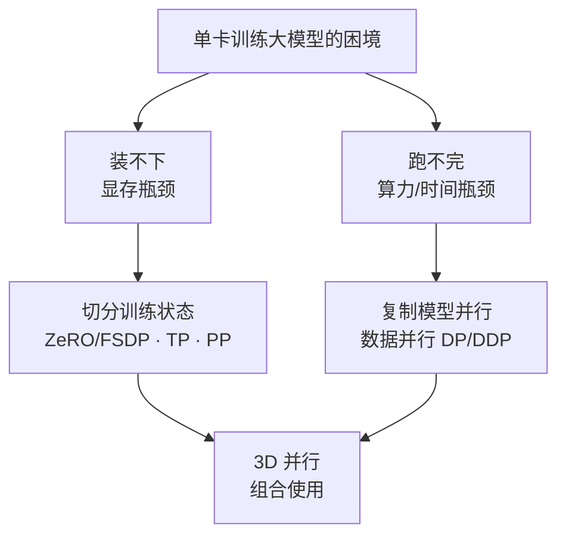
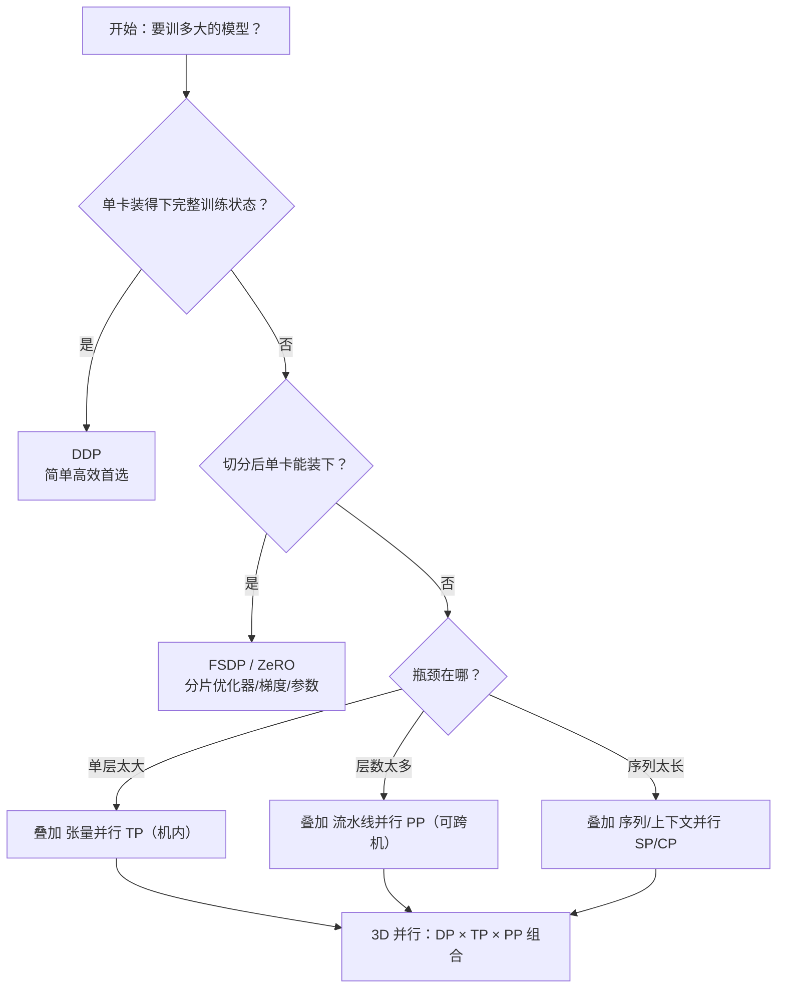

在一头扎进 DDP、ZeRO、张量并行这些具体技术之前，得先搭好认知地图：单卡到底卡在哪、训练究竟要吃多少显存、有哪些并行策略各自在解决什么。本文用具体数字手算显存账本，再总览五大并行策略与选择原则，让你对后续每一章"在解决什么问题"建立清晰坐标。

<!-- more -->

## 📑 目录

- [1. 为什么需要分布式训练：装不下与跑不完](#1-为什么需要分布式训练装不下与跑不完)
- [2. 训练显存账本：手算一遍就懂](#2-训练显存账本手算一遍就懂)
- [3. 五大并行策略全景](#3-五大并行策略全景)
- [4. 并行策略选择原则](#4-并行策略选择原则)
- [总结](#-总结)
- [自我检验清单](#-自我检验清单)
- [参考资料](#-参考资料)

---

## 1. 为什么需要分布式训练：装不下与跑不完

训练神经网络，本质是反复做"前向算 loss → 反向算梯度 → 优化器更新参数"。模型小时一块 GPU 全程装得下也跑得快，根本不需要分布式。但当模型膨胀到几百亿、几千亿参数，单卡会在两个维度同时撞墙。

🔑 **核心概念**：分布式训练要解决的从来不是一个问题，而是两个相互独立的问题——**显存装不下**（空间）和**时间跑不完**（速度）。看懂这两者的区别，是理解所有并行策略的前提。

打个比方：单卡训大模型，就像让一个人用一张小书桌整理一整座图书馆——**桌子太小摊不开**（显存不够），而且**一个人搬一辈子也搬不完**（算力不够）。两个困境解法不同：前者要"拆开放到几张桌子上"，后者要"多叫几个人一起搬"。

### 1.1 装不下：显存瓶颈

很多人的直觉是"模型多少参数就占多少显存"，这是严重低估。训练时的显存远不止参数本身（下一节细算）。粗略地说，BF16 混合精度 + Adam 下**每个参数约需 16~18 字节静态显存**。用 LLaMA 系列估一下（仅静态显存，暂不含激活值）：

| 📊 模型规模 | 参数量 $\Psi$ | 静态显存 $\approx 16\Psi$ | 单卡能否装下（H100 80GB） |
|------------|--------------|--------------------------|--------------------------|
| LLaMA 7B | $7 \times 10^9$ | $\approx 112$ GB | ❌ 装不下 |
| LLaMA 70B | $70 \times 10^9$ | $\approx 1120$ GB | ❌ 远超 |
| LLaMA 405B | $405 \times 10^9$ | $\approx 6480$ GB | ❌ 需数十卡 |

⚠️ **注意**：连"小号"的 7B 模型，光静态显存就约 112 GB，**已超过单张 H100 的 80 GB**——还没算前向堆积的激活值。这就是第一个动因：**模型规模超过单卡显存容量**。

### 1.2 跑不完：算力与时间瓶颈

即便显存无限大，单卡还有"算得太慢"这道坎。大模型训练的计算量有个广为引用的经验公式（$C$ 为总浮点运算次数，$\Psi$ 为参数量，$D$ 为训练 token 数）：

$$
C \approx 6 \Psi D
$$

这个 "6" 来自前向约 2 倍、反向约 4 倍参数量的乘加。代入 70B 模型训 1T（$10^{12}$）token：

$$
C \approx 6 \times (70 \times 10^9) \times 10^{12} = 4.2 \times 10^{23} \text{ FLOPs}
$$

单张 H100 的 BF16 算力峰值约 $10^{15}$ FLOP/s，乐观假设 50\% 有效利用率（MFU）：

$$
T = \frac{4.2 \times 10^{23}}{10^{15} \times 0.5} \approx 8.4 \times 10^8 \text{ 秒} \approx 26.6 \text{ 年}
$$

💡 **提示**：单卡训 70B 要二十多年——等训完模型架构都换好几代了。而 $N$ 卡数据并行理论上能把时间压到接近 $1/N$，1024 卡可降到约 9 天量级。这就是第二个动因：**单卡算力不足以在可接受时间内完成训练**。

📌 **关键点**：两个瓶颈解法方向不同——"装不下"靠**切分状态**（把一份东西拆到多卡），"跑不完"靠**复制并行**（多卡各干一摊活）。后续策略也分属这两条线。

## 2. 训练显存账本：手算一遍就懂

这是本章重点。我们把"训练到底吃多少显存"逐项拆开，亲手算一遍 7B 模型的账，以后估算任意规模都心里有数。

训练显存分**静态显存**（与训练步无关、常驻）和**激活值显存**（随 batch / 序列长度变化）两大块。

### 2.1 静态显存四大组成

以最主流的 **BF16 混合精度 + Adam 优化器** 为例。设参数量为 $\Psi$，逐项分析（单位：Bytes）：

| 组成 | 精度 | 每参数字节 | 说明 |
|------|------|-----------|------|
| 模型参数 | BF16 | $2\Psi$ | 前向/反向用的工作副本 |
| 梯度 | BF16 | $2\Psi$ | 反向产出，与参数同形状 |
| 优化器 - FP32 参数副本 | FP32 | $4\Psi$ | Adam 维护的高精度主权重 |
| 优化器 - 一阶动量 $m$ | FP32 | $4\Psi$ | 梯度的指数滑动平均 |
| 优化器 - 二阶动量 $v$ | FP32 | $4\Psi$ | 梯度平方的指数滑动平均 |

把优化器三项加起来就是 Adam 著名的 $12\Psi$。总静态显存：

$$
M\_{\text{static}} = \underbrace{2\Psi}\_{\text{参数}} + \underbrace{2\Psi}\_{\text{梯度}} + \underbrace{12\Psi}\_{\text{Adam 状态}} = 16\Psi \text{ Bytes}
$$

🔑 **核心概念**：训练显存的"大头"其实是**优化器状态**（$12\Psi$，占了 16 里的 12），而非参数本身。这正是 ZeRO 第一刀就切优化器状态的原因——它是性价比最高的下手处。

⚠️ **注意**：很多资料写"每参数 16~18 字节"，那个 16~20 的浮动来自实现细节差异（比如是否额外保留一份 FP32 梯度、是否用了 FP32 主梯度累加）。本文用最经典的 BF16 混合精度配置，记 $16\Psi$ 即可。

### 2.2 手算 7B 模型静态显存

代入 $\Psi = 7 \times 10^9$：

$$
M\_{\text{static}} = 16 \times 7 \times 10^9 = 1.12 \times 10^{11} \text{ Bytes} \approx 112 \text{ GB}
$$

逐项看更直观：

- 参数：$2 \times 7\text{B} = 14$ GB
- 梯度：$2 \times 7\text{B} = 14$ GB
- 优化器状态：$12 \times 7\text{B} = 84$ GB
- **合计 ≈ 112 GB**

一张 H100 只有 80 GB——**静态显存就已经装不下了**。

### 2.3 别忘了激活值

激活值是前向传播中为反向传播保留的中间结果，它**随 batch size $b$ 和序列长度 $s$ 线性/超线性增长**，是长序列、大 batch 训练里真正的"显存刺客"。

对 Transformer，单层激活值的粗略量级正比于 $b \cdot s \cdot h$（$h$ 为隐藏维），全模型再乘层数 $L$。激活值的精确公式涉及注意力中间量、是否开 Activation Checkpointing 等，这里只需建立直觉：

📌 **关键点**：静态显存只取决于参数量，是"固定成本"；激活值取决于 $b$、$s$，是"可调成本"。当你 OOM 时，先想到的应是减小 batch、开梯度累积或 Activation Checkpointing 来压激活值——这些是第8章的主题。

### 2.4 显存估算速查

| 📊 项目 | 公式（Bytes） | 取决于 |
|---------|--------------|--------|
| 参数 | $2\Psi$ | 参数量 |
| 梯度 | $2\Psi$ | 参数量 |
| Adam 状态 | $12\Psi$ | 参数量 |
| **静态合计** | $\mathbf{16\Psi}$ | 参数量 |
| 激活值 | $\propto b \cdot s \cdot h \cdot L$ | batch / 序列 / 模型宽深 |

记住这张表，给定任意参数量都能 30 秒估出训练显存下限。

## 3. 五大并行策略全景

知道了瓶颈在哪、显存花在哪，接下来总览五种主流并行策略。每种策略的本质都是回答两个问题：**切什么**（决定省不省显存）、**怎么通信**（决定快不快）。

| 策略 | ✂️ 切什么 | 📡 主要通信 | 🎯 解决的问题 |
|------|----------|-----------|--------------|
| 数据并行 DP/DDP | 切数据，模型不切 | 梯度 AllReduce | 跑不完（加速） |
| ZeRO / FSDP | 切优化器/梯度/参数 | ReduceScatter + AllGather | 装不下（省显存） |
| 张量并行 TP | 切单层的矩阵运算 | 层内 AllReduce | 单层太大 |
| 流水线并行 PP | 切网络层（按深度分段） | 段间传激活值（P2P） | 层数太多 |
| 序列并行 SP / 上下文并行 CP | 沿序列维度切 | 序列维 AllGather / All-to-All | 序列太长 |

逐个建立直觉：

- **数据并行（DP/DDP）**：每卡一份完整模型，各算各的数据分片，反向时 AllReduce 同步梯度。它**不省显存**（每卡仍装完整模型），但能近线性加速——主攻"跑不完"。
- **ZeRO / FSDP**：DDP 的"显存优化版"。既然每卡都存了一份完全相同的优化器状态/梯度/参数，那不如分片存储、用时再 AllGather 拼回来——主攻"装不下"。
- **张量并行（TP）**：把一层（如一个大 Linear）的权重矩阵按行/列切到多卡，每卡算一部分再合并。通信频繁且量大，因此**只适合机内 NVLink**——解决"单层太大"。
- **流水线并行（PP）**：把模型按层切成几段，每段放一台/一组机器，激活值像流水线一样在段间传递。通信量小（只传激活值），**可跨机**——解决"层数太多"。
- **序列并行 / 上下文并行（SP/CP）**：沿序列长度维切分，让超长上下文（如 128K）也能放下——解决"序列太长"。

## 4. 并行策略选择原则

有了全景，怎么选？核心只有一句话：**通信带宽决定策略的作用域**。

### 4.1 带宽决定"谁放机内、谁能跨机"

不同互联的带宽差一个数量级，这直接决定通信密集型策略只能放在哪：

| 互联 | 带宽量级 | 适配策略 |
|------|---------|---------|
| NVLink / NVSwitch（机内） | 数百 GB/s（如 NVLink 900 GB/s） | TP（通信最频繁，必须机内） |
| InfiniBand / RoCE（机间） | 数百 Gbps（如 400 Gbps ≈ 50 GB/s） | PP、DP（通信稀疏，可跨机） |
| 以太网 | 更低 | 仅 DP 这类低频通信勉强可用 |

📌 **关键点**：TP 每一层前向/反向都要 AllReduce，通信极频繁，放到跨机带宽上会被通信拖垮，所以**TP 几乎总是限制在单机 8 卡内**；PP 只在段边界传一次激活值，DP 一步只同步一次梯度，二者都能跨机。这是 3D 并行布局的根本依据。

### 4.2 一棵实用决策树

✅ **推荐路径**：从最简单的够用方案起步，不够了再加维度——单卡装得下就 DDP；装不下先上 FSDP/ZeRO；还不行再按瓶颈叠 TP/PP/CP；千亿级才需要全套 3D 并行。

❌ **不推荐**：一上来就堆 3D 并行。每多一个并行维度都会显著增加调试复杂度和通信开销，过早优化得不偿失。

## 📝 总结

- 分布式训练解决两个独立问题：显存"装不下"（切分状态）和时间"跑不完"（复制并行）。
- 训练静态显存 $= 16\Psi$ Bytes（参数 $2\Psi$ + 梯度 $2\Psi$ + Adam 状态 $12\Psi$），大头是优化器状态；7B 模型仅静态就约 112 GB，超单张 H100。
- 激活值随 batch / 序列长度增长，是可调成本，OOM 时优先从这里压（减 batch、梯度累积、Activation Checkpointing）。
- 五大策略各有分工：DP/DDP 抢时间，ZeRO/FSDP 省显存，TP 切单层、PP 切层数、SP/CP 切序列。
- 选型核心是"带宽决定作用域"：TP 必须机内 NVLink，PP/DP 可跨机；按"够用就好、不够再加维度"的决策树逐步升级到 3D 并行。

## 🎯 自我检验清单

- 能用一句话说清分布式训练要解决的两个独立问题，并指出各自的解法方向
- 能逐项写出 BF16 + Adam 训练的静态显存组成，并解释为什么是 $16\Psi$
- 能手算给定参数量模型的静态显存，并判断单卡是否装得下
- 能用 $C \approx 6\Psi D$ 估算训练总计算量并推算单卡耗时
- 能画出五大并行策略的"切什么 × 怎么通信 × 解决什么"对比表
- 能解释为什么 TP 必须放机内而 PP/DP 可以跨机
- 能根据模型规模和集群拓扑，用决策树选出合适的并行策略组合

## 📚 参考资料

- [Scaling Laws for Neural Language Models](https://arxiv.org/abs/2001.08361)
- [LLaMA: Open and Efficient Foundation Language Models](https://arxiv.org/abs/2302.13971)
- [ZeRO: Memory Optimizations Toward Training Trillion Parameter Models](https://arxiv.org/abs/1910.02054)
- [Reducing Activation Recomputation in Large Transformer Models](https://arxiv.org/abs/2205.05198)
- [Megatron-LM: Training Multi-Billion Parameter Language Models Using Model Parallelism](https://arxiv.org/abs/1909.08053)
