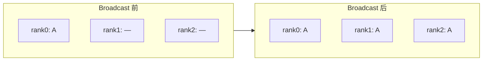
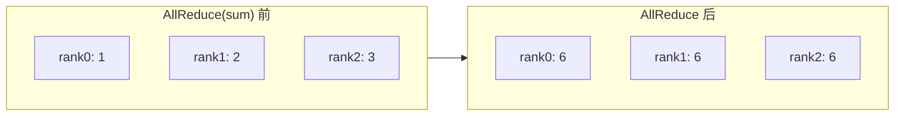
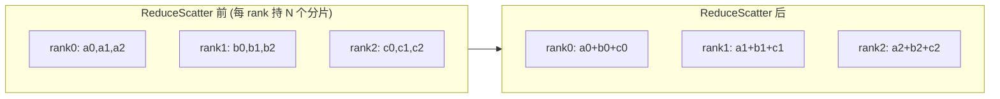
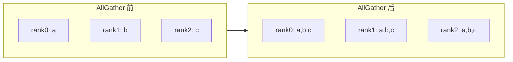

所有并行策略最终都落到同一件事上：多张卡之间如何高效交换数据。DDP 靠 AllReduce 同步梯度、ZeRO 用 ReduceScatter、TP 用 AllReduce、MoE 用 All-to-All——这套"通信字母表"会在后续每一章反复出现。本文把它们一次讲清：每个原语的"输入 → 输出"语义、Ring AllReduce 为什么通信量与卡数无关，以及如何量化任何一次通信的耗时。

<!-- more -->

## 📑 目录

- [1. 为什么要单独讲通信原语](#1-为什么要单独讲通信原语)
- [2. 点对点通信：一切的基础](#2-点对点通信一切的基础)
- [3. 集合通信原语详解](#3-集合通信原语详解)
- [4. Ring AllReduce 算法原理](#4-ring-allreduce-算法原理)
- [5. 通信量的量化方法](#5-通信量的量化方法)
- [6. 动手实验](#6-动手实验)
- [总结](#-总结)
- [自我检验清单](#-自我检验清单)
- [参考资料](#-参考资料)

---

## 1. 为什么要单独讲通信原语

并行训练的本质可以浓缩成一个公式：**并行 = 切分 + 通信**。切分决定了显存怎么省、负载怎么分；而切分之后各卡手里只有"半成品"，必须靠通信把它们拼成正确结果。

🔑 **核心概念**：切分决定显存，通信决定速度。一个并行策略快不快，往往不取决于它怎么切，而取决于它每一步要传多少数据、走什么网络——这正是通信原语要回答的问题。

打个比方：通信原语就像一支球队的几套固定战术配合（传中、回传、二过一）。球员（GPU）平时各管一摊，但到了关键时刻必须按既定套路把球（数据）准确传到位。把这几套"战术"吃透，后面看任何阵型（并行策略）都能立刻看懂球是怎么流动的。

先给一张全景对照表，建立"哪个策略用哪个原语"的直觉，后续再逐个展开：

| 📡 通信原语 | 典型使用它的并行策略 |
|------------|---------------------|
| AllReduce | DDP 梯度同步、TP 输出合并 |
| ReduceScatter | ZeRO-2/3、FSDP 反向 |
| AllGather | ZeRO-3 前向、FSDP 重组参数 |
| All-to-All | MoE 专家并行、Ulysses 序列并行 |
| Broadcast | 初始化时同步参数 |
| send / recv | 流水线并行传激活值 |

⚠️ **注意**：通信发生在不同层级的硬件上，带宽差一个数量级——机内 NVLink 可达数百 GB/s，机间 InfiniBand 约 50 GB/s 量级，PCIe 更低。**同样一个 AllReduce，放机内还是跨机，耗时可能差十倍**。这是后续所有"哪个策略放哪里"决策的物理根源。

## 2. 点对点通信：一切的基础

集合通信再花哨，底层都是由最朴素的"两个进程之间收发数据"组合而成的。这就是点对点通信（Point-to-Point, P2P）。

- `send(tensor, dst)`：把张量发给目标 rank
- `recv(tensor, src)`：从源 rank 接收张量

流水线并行（PP）的 Stage 之间传递激活值，靠的就是它。

P2P 分同步和异步两种，这里藏着一个经典的死锁陷阱：

```python
import torch.distributed as dist

# ❌ 危险写法：两个进程都先 send 再 recv，可能死锁
# rank 0 和 rank 1 都卡在 send 等对方 recv
dist.send(tensor, dst=peer)
dist.recv(tensor, src=peer)
```

⚠️ **注意**：如果两个进程都用阻塞式 `send` 先发后收，且底层缓冲区不足以暂存，双方就会都卡在 `send` 上等对方来 `recv`，形成**死锁**。

✅ 解决办法有两种：

```python
# 方案 A：错开顺序——一方先发后收，另一方先收后发
if rank == 0:
    dist.send(tensor, dst=1)
    dist.recv(tensor, src=1)
else:
    dist.recv(tensor, src=0)
    dist.send(tensor, dst=0)

# 方案 B：用异步原语 isend / irecv，先发起再统一等待
reqs = [dist.isend(send_buf, dst=peer), dist.irecv(recv_buf, src=peer)]
for r in reqs:
    r.wait()
```

📌 **关键点**：实际框架里更推荐 `dist.batch_isend_irecv()` 一次性提交一批收发请求，由后端统一调度，既避免死锁又能重叠通信。PP 的实现大量依赖这种异步批量收发。

## 3. 集合通信原语详解

集合通信（Collective Communication）是**一组进程共同参与的、有固定语义的数据交换模式**。下面逐个给出"输入 → 输出"语义和典型用途。记号约定：共 $N$ 个 rank，每个 rank 持有的数据块用其内容标注。

### 3.1 Broadcast：一份数据复制给所有人

一个根 rank 持有数据，复制到所有 rank。



换成具体数据看更清楚——根 rank（GPU0）持有 $[1,2,3]$，其余卡为空，Broadcast 后所有卡都拿到同一份拷贝：

```
操作前:          Broadcast 后:
GPU0: [1,2,3]    GPU0: [1,2,3]
GPU1: [ ]        GPU1: [1,2,3]
GPU2: [ ]        GPU2: [1,2,3]
GPU3: [ ]        GPU3: [1,2,3]
```

**典型用途**：训练开始时，把 rank 0 的初始模型参数广播给所有进程，保证各卡起点一致（DDP 初始化就是这么做的）。

### 3.2 Scatter / Gather：分发与收集

- **Scatter**：根 rank 把一个大张量切成 $N$ 份，第 $i$ 份发给 rank $i$（分发）
- **Gather**：每个 rank 把自己的数据交给根 rank，拼成完整张量（收集，Scatter 的逆操作）

以 4 卡为例，根 rank（GPU0）持有一个长度为 4 的张量，Scatter 把它逐段拆给各卡；Gather 则是反过来把各卡的数据收回根 rank 拼成完整张量：

```
Scatter（GPU0 分发）:        Gather（收集回 GPU0）:
操作前         操作后        操作前       操作后
GPU0:[a,b,c,d] GPU0:[a]      GPU0:[a]     GPU0:[a,b,c,d]
GPU1:[ ]       GPU1:[b]      GPU1:[b]     GPU1:[b]
GPU2:[ ]       GPU2:[c]      GPU2:[c]     GPU2:[c]
GPU3:[ ]       GPU3:[d]      GPU3:[d]     GPU3:[d]
```

注意 Scatter 与 Broadcast 的区别：Broadcast 把**同一份完整数据**复制给所有卡，Scatter 把数据**切开分发**，每卡只拿到其中一段。

**典型用途**：早期 DataParallel 用 Scatter 分发 mini-batch、Gather 收集输出；现在更多用于数据预处理阶段的切分。

### 3.3 Reduce：规约到一个 rank

所有 rank 的数据按某种运算（求和、求最大等）规约，结果只放到根 rank。

$$
\text{rank}\_{\text{root}} \leftarrow \sum\_{i=0}^{N-1} x\_i
$$

具体到向量上——4 张卡各持一个长度为 3 的向量，Reduce(sum) 后只有根 rank（GPU0）拿到逐元素求和的结果，其余卡数据不变：

```
操作前:          Reduce(sum) 到 GPU0:
GPU0: [1,2,3]    GPU0: [10,20,30]
GPU1: [2,4,6]    GPU1: [2,4,6]    (不变)
GPU2: [3,6,9]    GPU2: [3,6,9]    (不变)
GPU3: [4,8,12]   GPU3: [4,8,12]   (不变)
```

⚠️ **注意**：Reduce 与 AllReduce 的差别只在"结果给谁"——Reduce 只汇总到根 rank，AllReduce 则让**所有 rank 都拿到**同一份结果。这也是为什么 $\text{AllReduce} = \text{Reduce} + \text{Broadcast}$。

### 3.4 AllReduce：规约结果人人有份（本章核心）

最重要的原语。所有 rank 的数据规约后，**结果广播回每一个 rank**。语义上等价于 `Reduce` 之后再 `Broadcast`，但实现上远比"先归约再广播"高效（见下一节的 Ring 算法）。



如果把数据换成更贴近梯度的向量，过程会更直观——4 张卡各持一个长度为 3 的向量，AllReduce(sum) 后每张卡都拿到逐元素求和的结果：

```
操作前:          AllReduce(sum) 后:
GPU0: [1,2,3]    GPU0: [10,20,30]
GPU1: [2,4,6]    GPU1: [10,20,30]
GPU2: [3,6,9]    GPU2: [10,20,30]
GPU3: [4,8,12]   GPU3: [10,20,30]
```

注意求和是**按元素对齐**的：第一个分量 $1+2+3+4=10$，第二个分量 $2+4+6+8=20$，第三个分量 $3+6+9+12=30$。操作完成后四张卡的内容完全一致——这正是 DDP 里"所有卡梯度同步"的含义。

**典型用途**：DDP 同步梯度——每卡算出本地梯度后，AllReduce 求和（再除以 $N$ 取平均），使所有卡拿到一致的全局平均梯度；TP 中也用它合并切分矩阵乘的部分和。

### 3.5 ReduceScatter：规约后只留自己那份

规约（求和）之后，每个 rank **只保留结果的一个分片**，而不是完整结果。



换成数值看更直观——4 张卡各持一个长度为 4 的向量（4 个分片），ReduceScatter(sum) 先把所有卡按元素求和，再让第 $i$ 张卡只保留第 $i$ 个分片：

```
操作前:            ReduceScatter(sum) 后:
GPU0: [1,2,3,4]    GPU0: [4]    (第 0 片求和: 1+1+1+1)
GPU1: [1,2,3,4]    GPU1: [8]    (第 1 片求和: 2+2+2+2)
GPU2: [1,2,3,4]    GPU2: [12]   (第 2 片求和: 3+3+3+3)
GPU3: [1,2,3,4]    GPU3: [16]   (第 3 片求和: 4+4+4+4)
```

这里 4 张卡持有相同向量只是为了让求和结果一目了然：每个分片被 4 张卡各贡献一次，故第 $i$ 片结果为 $4 \times (i{+}1)$。

**典型用途**：ZeRO-2/3 和 FSDP 反向传播——梯度规约后，每卡只需要自己负责更新的那一分片，正好用 ReduceScatter 一步到位。

### 3.6 AllGather：分片拼成完整数据

每个 rank 持有一个分片，操作后**每个 rank 都拿到拼接起来的完整数据**。它不做规约，只做拼接。



每张卡各持一个分片，AllGather 后所有卡都集齐了完整序列（只拼接、不求和）：

```
操作前:       AllGather 后:
GPU0: [A]     GPU0: [A,B,C,D]
GPU1: [B]     GPU1: [A,B,C,D]
GPU2: [C]     GPU2: [A,B,C,D]
GPU3: [D]     GPU3: [A,B,C,D]
```

💡 **提示**：把这张图和 ReduceScatter 的图叠起来看——ReduceScatter 让每卡"从完整数据收缩到一个求和分片"，AllGather 让每卡"从一个分片扩张回完整数据"，二者正好互为逆向，合起来就是 $\text{AllReduce} = \text{ReduceScatter} + \text{AllGather}$。

**典型用途**：ZeRO-3 / FSDP 前向，每卡只存参数分片，计算前用 AllGather 临时拼出完整层参数。

### 3.7 All-to-All：人人给人人发不同数据

最"全连接"的原语：每个 rank 都给其他每个 rank 发送一份**各不相同**的数据。可以理解为一次分布式的矩阵转置。

以 4 卡为例，记 $D_{ij}$ 表示"原本在 GPU$i$、要发给 GPU$j$"的那块数据。操作前每张卡按**目的地**排好 4 块数据；操作后每张卡收到的是所有卡发给它的数据，相当于把数据矩阵做了一次转置（行列互换）：

```
操作前(每卡按目的地排):       All-to-All 后(每卡收齐发给自己的):
GPU0: [D00,D01,D02,D03]       GPU0: [D00,D10,D20,D30]
GPU1: [D10,D11,D12,D13]       GPU1: [D01,D11,D21,D31]
GPU2: [D20,D21,D22,D23]       GPU2: [D02,D12,D22,D32]
GPU3: [D30,D31,D32,D33]       GPU3: [D03,D13,D23,D33]
```

可以看到第 $j$ 列（所有卡发给 GPU$j$ 的块）在操作后变成了 GPU$j$ 的那一行——这正是"矩阵转置"的含义。

**典型用途**：MoE 专家并行——token 要根据路由结果发往不同卡上的专家，正是 All-to-All；Ulysses 序列并行也用它在序列维和注意力头维之间切换切分方式。

### 3.8 一个贯穿全书的恒等式

这三者之间有个极其重要的关系，后面 ZeRO、序列并行反复用到：

$$
\text{AllReduce} = \text{ReduceScatter} + \text{AllGather}
$$

📌 **关键点**：直观理解——先 ReduceScatter 让每卡拿到"自己那份的全局求和结果"，再 AllGather 把各卡的分片拼回完整结果，二者合起来就完成了 AllReduce。这个拆解不仅是理论恒等式，更是 Ring AllReduce 的实现蓝图（见下一节），也是 ZeRO 能"用两个半步通信代替一次 AllReduce"的根本依据。

## 4. Ring AllReduce 算法原理

AllReduce 是训练里最高频的通信，它的效率直接决定 DDP 的扩展性。这一节讲清它为什么能做到"通信量与卡数无关"这一惊艳特性。

### 4.1 朴素 AllReduce 的问题

最直接的实现：所有卡把数据发给一个中心 rank，中心求和后再广播回去。问题在于**中心节点成了带宽瓶颈**——$N$ 张卡的数据都要挤过它的一条网络链路，卡越多越堵。它的通信时间随 $N$ 线性增长，完全无法扩展。

打个比方：这就像全班作业都交给一个课代表统计再挨个发回，人越多课代表越累，效率越低。

### 4.2 Ring：把所有卡连成一个环

Ring AllReduce 的思路是**去中心化**：把 $N$ 张卡逻辑上连成一个环，每张卡只和左右邻居通信，没有中心节点。它分两个阶段，正好对应上一节的恒等式 $\text{AllReduce} = \text{ReduceScatter} + \text{AllGather}$。

设每张卡持有大小为 $\Psi$ 的数据（如梯度），先把它切成 $N$ 个分片。

**阶段一：Reduce-Scatter（$N-1$ 步）**

每一步，每张卡把自己的一个分片发给下一个邻居，同时接收上一个邻居发来的分片并累加。经过 $N-1$ 步后，**每张卡上都有一个分片是"全局求和完成"的**（不同卡完成的是不同分片）。

**阶段二：All-Gather（$N-1$ 步）**

现在每张卡手里有一个"已求和好"的分片，再沿环传递 $N-1$ 步，把这些完整分片传遍所有卡。结束后每张卡都集齐了全部 $N$ 个求和后的分片，即完整的 AllReduce 结果。


### 4.3 通信量推导：为什么与卡数无关

这是 Ring 算法的精髓。我们算一下每张卡总共要收发多少数据。

数据被切成 $N$ 份，每份大小 $\frac{\Psi}{N}$。两个阶段各 $N-1$ 步，每步每张卡发送一个分片：

$$
\text{每卡发送量} = \underbrace{(N-1)\cdot\frac{\Psi}{N}}\_{\text{Reduce-Scatter}} + \underbrace{(N-1)\cdot\frac{\Psi}{N}}\_{\text{All-Gather}} = 2\cdot\frac{N-1}{N}\Psi
$$

接收量与发送量相同。关键看这个系数：

$$
2\cdot\frac{N-1}{N}\Psi = 2\Psi\left(1 - \frac{1}{N}\right) \xrightarrow{N \text{ 较大}} 2\Psi
$$

🔑 **核心概念**：当卡数 $N$ 较大时，每卡收发量趋近于 $2\Psi$，**与卡数 $N$ 无关**！这意味着无论用 8 卡还是 1024 卡做 DDP，每张卡每步的通信量都稳定在约 $2\Psi$，不会随规模膨胀——这正是 Ring AllReduce 能支撑大规模数据并行的根本原因。

### 4.4 带宽最优性与其他拓扑

Ring 在**大数据量**下能逼近网络带宽上限（带宽最优），但它有 $2(N-1)$ 步，**延迟随 $N$ 线性增长**。所以：

| ✅ Ring AllReduce | ❌ 它的短板 | 📝 适用 |
|------------------|------------|---------|
| 大数据量带宽最优、与卡数无关 | 步数多、延迟随 N 增长 | 梯度同步等大块数据 |

- **Tree AllReduce**：树形拓扑，步数为 $O(\log N)$，**延迟低**，适合小数据量（如小张量、控制信号）。
- **Double Binary Tree**：NCCL 2.4 引入的树形算法，在大规模多机 AllReduce 中兼顾带宽和延迟，是 NCCL Tree 算法的常用实现。
- 实际中 **NCCL 会根据数据量、卡数、拓扑自动选择** Ring / Tree 等算法，无需手动指定——这也是为什么用 `NCCL_DEBUG=INFO` 能看到它"选了哪种算法"。

## 5. 通信量的量化方法

掌握了原语和 Ring 推导，现在建立一套通用的"通信量记账法"，以后分析任何策略都能自己估算。

### 5.1 统一记号

| 符号 | 含义 |
|------|------|
| $\Psi$ | 参数量（或待通信张量的元素数） |
| $N$ | 参与通信的 rank 数 |
| $\alpha$ | 单次通信的固定延迟（latency） |
| $B$ | 链路带宽（Bytes/s） |

### 5.2 三类原语的每卡通信量

基于 Ring 实现，常用原语每卡的收发总量（大 $N$ 近似）：

| 📡 原语 | 每卡通信量 | 记忆法 |
|---------|-----------|--------|
| AllReduce | $2\Psi$ | ReduceScatter + AllGather |
| ReduceScatter | $\Psi$ | AllReduce 的一半 |
| AllGather | $\Psi$ | AllReduce 的另一半 |

📌 **关键点**：这张表解释了一个常见困惑——为什么 FSDP（ZeRO-3）每步通信量是 $3\Psi$ 而 DDP 只有 $2\Psi$。因为 FSDP 前向要 AllGather（$\Psi$）、反向要 AllGather（$\Psi$）+ ReduceScatter（$\Psi$），合计 $3\Psi$，比 DDP 多 50\%——这正是它省显存付出的通信代价。这个账，到第4、5章会反复用到。

### 5.3 通信时间估算模型

一次通信的耗时可以用经典的 $\alpha$-$\beta$ 模型估算（$\beta = 1/B$ 是单位数据传输时间）：

$$
T \approx \alpha + \frac{\text{数据量}}{B}
$$

- **延迟项 $\alpha\$**：每次通信的固定开销（建立连接、同步），与数据量无关。小数据量时它主导——这就是小张量适合用低延迟的 Tree 算法的原因。
- **带宽项 $\frac{\text{数据量}}{B}\$**：数据量越大、带宽越低，耗时越长。大数据量时它主导——这就是大梯度适合用带宽最优的 Ring 的原因。

💡 **提示**：估算时务必用对带宽。机内 NVLink（数百 GB/s）和机间 IB（约 50 GB/s）代入同一个公式会得到差十倍的结果——这定量解释了"为什么 TP 必须放机内"。

### 5.4 计算与通信重叠

最后一个关键优化思想：通信不必"干等"。现代框架会让**通信和计算并行进行**（overlap）——比如 DDP 在反向传播算后面层梯度的同时，就把前面已算好的梯度发出去做 AllReduce。

🔑 **核心概念**：理想情况下，如果通信能完全被计算"盖住"，那么通信几乎"免费"。这就是 DDP 的 Bucket 机制、ZeRO 的 prefetch 等优化的共同目标——把上面公式里的 $T_{\text{comm}}$ 尽可能藏到计算时间里。第4章会看到它的具体实现。

## 6. 动手实验

理论之后，用 `torch.distributed` 亲手验证这些原语的语义。下面的脚本用 `torchrun --nproc_per_node=4 collective_demo.py` 运行。

```python
# collective_demo.py
import os
import torch
import torch.distributed as dist


def main():
    dist.init_process_group(backend="nccl")
    rank = dist.get_rank()
    world_size = dist.get_world_size()
    torch.cuda.set_device(rank)
    device = torch.device(f"cuda:{rank}")

    # ---- 实验 1: AllReduce(sum) ----
    # 每卡持有自己的 rank 值，求和后应所有卡都得到 0+1+2+3=6
    x = torch.tensor([float(rank)], device=device)
    dist.all_reduce(x, op=dist.ReduceOp.SUM)
    print(f"[AllReduce] rank{rank} -> {x.item()}")  # 全部输出 6.0

    # ---- 实验 2: AllGather ----
    # 每卡持有一个分片，收集后每卡都拿到 [0,1,2,3]
    src = torch.tensor([float(rank)], device=device)
    gathered = [torch.zeros(1, device=device) for _ in range(world_size)]
    dist.all_gather(gathered, src)
    print(f"[AllGather] rank{rank} -> {[t.item() for t in gathered]}")

    # ---- 实验 3: ReduceScatter ----
    # 每卡提供 world_size 个分片，规约后各卡只留自己那份
    inputs = [torch.tensor([float(rank * 10 + i)], device=device)
              for i in range(world_size)]
    out = torch.zeros(1, device=device)
    dist.reduce_scatter(out, inputs, op=dist.ReduceOp.SUM)
    print(f"[ReduceScatter] rank{rank} -> {out.item()}")

    dist.destroy_process_group()


if __name__ == "__main__":
    main()
```

配合 `NCCL_DEBUG=INFO` 运行，还能观察 NCCL 实际选了哪种算法：

```bash
NCCL_DEBUG=INFO torchrun --nproc_per_node=4 collective_demo.py 2>&1 | grep -i "Ring\|Tree\|Algorithm"
```

✅ **建议练习**：把张量大小从 1 个元素逐步加大到几百 MB，用 `torch.cuda.Event` 计时，对比 AllReduce 实测带宽——你会看到小数据量时延迟主导、大数据量时逼近链路带宽，正好印证 $T \approx \alpha + \text{数据量}/B$ 模型。

## 📝 总结

- 并行 = 切分 + 通信；切分决定显存，通信决定速度。通信原语是看懂所有并行策略的"字母表"。
- 点对点 send/recv 是基础，PP 靠它传激活值；注意阻塞式收发的死锁，用错开顺序或异步 isend/irecv 解决。
- 七个集合原语各有固定语义：Broadcast 复制、Scatter/Gather 分发收集、Reduce 规约到一点、AllReduce 规约给所有人、ReduceScatter 规约留分片、AllGather 拼接、All-to-All 全交换。
- 核心恒等式 $\text{AllReduce} = \text{ReduceScatter} + \text{AllGather}$ 既是 Ring 的实现蓝图，也是 ZeRO 通信分析的基础。
- Ring AllReduce 每卡通信量 $\approx 2\Psi$，与卡数无关，是大规模 DDP 的基石；小数据量则用低延迟的 Tree。
- 通信耗时用 $T \approx \alpha + \text{数据量}/B$ 估算，务必代入正确带宽；计算通信重叠能把通信"藏进"计算里。

## 🎯 自我检验清单

- 能画出 7 个集合通信原语的"输入 → 输出"语义图
- 能说出 DDP、ZeRO、TP、MoE 各自主要依赖哪个通信原语
- 能解释点对点阻塞收发为什么会死锁，并写出两种避免方法
- 能推导 Ring AllReduce 每卡通信量为 $2\frac{N-1}{N}\Psi \approx 2\Psi$ 且与卡数无关
- 能默写恒等式 $\text{AllReduce} = \text{ReduceScatter} + \text{AllGather}$ 并解释它在 ZeRO 中的意义
- 能用 $T \approx \alpha + \text{数据量}/B$ 估算一次通信耗时，并说明何时该用 Ring、何时该用 Tree
- 能解释为什么 FSDP 每步通信量是 $3\Psi$ 而 DDP 是 $2\Psi$

## 📚 参考资料

- [Bringing HPC Techniques to Deep Learning（Ring AllReduce 原始解析）](https://andrew.gibiansky.com/blog/machine-learning/baidu-allreduce/)
- [NVIDIA NCCL 官方文档](https://docs.nvidia.com/deeplearning/nccl/user-guide/docs/index.html)
- [PyTorch Distributed Communication Package (torch.distributed)](https://pytorch.org/docs/stable/distributed.html)
- [Massively Scale Your Deep Learning Training with NCCL 2.4（Double Binary Tree）](https://developer.nvidia.com/blog/massively-scale-deep-learning-training-nccl-2-4/)
- [Horovod: fast and easy distributed deep learning in TensorFlow](https://arxiv.org/abs/1802.05799)
