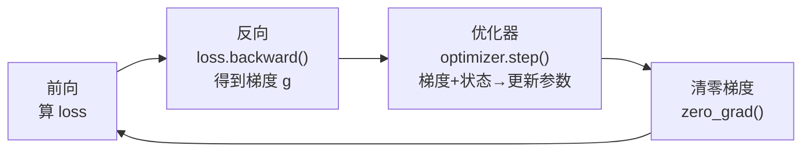

反向传播只告诉我们参数该往哪个方向走，"走多远、怎么走"全靠优化器决定。对做 AI Infra 的人来说，优化器还藏着一个更现实的问题：它偷偷占掉了训练显存的一大半。本文从优化器的演进讲起，重点算清楚 AdamW 到底吃了多少显存、为什么必须用 FP32，最后聊聊大 Batch 场景下 LAMB/LARS 的用武之地——这些都是理解后面 ZeRO 和混合精度的直接前提。

<!-- more -->

## 📑 目录

- [1. 优化器到底在训练里干什么](#1-优化器到底在训练里干什么)
- [2. 优化器演进：从 SGD 到 AdamW](#2-优化器演进从-sgd-到-adamw)
- [3. 优化器状态的显存开销](#3-优化器状态的显存开销)
- [4. 大 Batch 优化器：LARS 与 LAMB](#4-大-batch-优化器lars-与-lamb)
- [5. 动手：把优化器的显存账本翻出来看](#5-动手把优化器的显存账本翻出来看)
- [总结](#-总结)
- [自我检验清单](#-自我检验清单)
- [参考资料](#-参考资料)

---

## 1. 优化器到底在训练里干什么

先打个比方：如果说梯度是一张"下坡地图"，告诉你脚下哪个方向最陡，那优化器就是那个真正迈腿的登山者——地图只解决"朝哪走"，而"步子多大、要不要借上一步的惯性、这段路滑不滑要不要放慢"这些决定，全是优化器在做。

放到训练循环里，它的位置非常固定，夹在"算完梯度"和"下一轮前向"之间：



对应到代码上就是这四行的循环：

```python
for batch in dataloader:
    loss = model(batch)          # 前向：算预测、算损失
    loss.backward()              # 反向：算出每个参数的梯度
    optimizer.step()             # 优化器：结合梯度 + 内部状态更新参数
    optimizer.zero_grad()        # 清零梯度，准备下一轮
```

看似平平无奇的 `optimizer.step()`，一行代码背后其实做了三件事：读取每个参数的梯度、结合优化器自己维护的内部状态（动量、二阶矩等）算出更新量、把更新量应用到参数上。

🔑 **核心概念**：关键就在"内部状态"这四个字。这些状态在一次次 `step()` 之间**持久保存**在显存里——它不是算完就丢的临时变量，而是全程占着显存。这正是优化器成为显存大户的根源，也是本文第 3 节要重点算的账。

## 2. 优化器演进：从 SGD 到 AdamW

优化器的演进史，本质上是一部"不断给参数更新加辅助信息"的历史。每加一样东西，收敛更稳、更快，代价是每个参数要多存一份状态。理解这条线，就能顺带理解显存开销从哪来。

- **SGD**：最朴素的做法，更新规则 $\theta_{t+1} = \theta_t - \eta \cdot g_t$，学习率乘梯度，减就完事。没有任何额外状态。就像蒙着眼下山，只看脚下最陡的方向迈一步——简单，但容易在狭长山谷里左右横跳、来回震荡。

- **Momentum SGD**：给更新加了"惯性"，维护一个动量缓冲 $m_t = \beta m_{t-1} + g_t$，用它替代原始梯度去更新。相当于把球换成了带惯性的铅球，滚下山时不会被路上的小坑绊停，震荡也被平滑掉了。代价：每个参数多存一份一阶动量。

- **Adam**：同时记两样东西——一阶动量 $m_t$（梯度的指数移动平均，管"往哪走")和二阶动量 $v_t$（梯度平方的指数移动平均，管"这个方向历史上有多颠")。它的核心更新式为：

$$
\begin{aligned}
m_t &= \beta_1 m_{t-1} + (1-\beta_1) g_t
\end{aligned}
$$
$$
\begin{aligned}
v_t &= \beta_2 v_{t-1} + (1-\beta_2) g_t^2
\end{aligned}
$$
$$
\begin{aligned}
\theta_{t+1} &= \theta_t - \eta \cdot \frac{\hat{m}_t}{\sqrt{\hat{v}_t} + \epsilon}
\end{aligned}
$$

其中 $\hat{m}_t, \hat{v}_t$ 是对 $m_t, v_t$ 做偏差修正后的结果（初期 $m_0=v_0=0$ 会让估计偏小，需要除以 $1-\beta^t$ 修正）。分母上的 $\sqrt{\hat{v}_t}$ 就是"自适应"的来源：历史梯度大的参数分母大、步子收着点，一直很小的参数分母小、步子放大点。代价：每个参数要存 $m$ 和 $v$ 两份状态。

- **AdamW**：Adam 的一个重要修正。原始 Adam 把权重衰减（Weight Decay）塞进梯度里一起算（即 $g_t \leftarrow g_t + \lambda \theta_t$），结果它和自适应学习率纠缠在一起——分母 $\sqrt{\hat{v}_t}$ 会把不同参数的正则化力度扭曲得强弱不一。

AdamW 把权重衰减从梯度里拿出来，变成一步独立的参数缩放 $\theta_{t+1} \leftarrow \theta_{t+1} - \eta \lambda \theta_t$，与梯度更新彻底解耦。就这一个改动，让它成了当今大模型训练的事实标准。

一张表把这条演进线收束一下：

| ⚙️ 优化器 | 更新用到的信息 | 每参数额外状态 | 典型场景 |
|-----------|--------------|--------------|---------|
| SGD | 当前梯度 | 0 份 | 简单凸问题、教学 |
| Momentum | 梯度 + 一阶动量 | 1 份（$m$) | CV 里的 SGD+Momentum |
| Adam | 梯度 + 一阶 + 二阶动量 | 2 份（$m, v$) | 通用默认 |
| AdamW | 同 Adam，解耦 weight decay | 2 份（$m, v$) | 大模型训练标准 |

💡 **提示**：这条演进线里，"多存一份状态"是理解显存的钥匙——SGD 存 0 份、Momentum 存 1 份、Adam/AdamW 存 2 份。下一节的显存账，本质就是在数这个"份数"。

## 3. 优化器状态的显存开销

这一节是全文的重点。搞清楚优化器占多少显存，才能真正理解后面 ZeRO 为什么"专挑优化器状态下手"。

下面的分析都以**混合精度训练**为前提（这是当前主流）：前向和反向用 BF16/FP16 提速，但优化器内部一律用 FP32 保精度。

### 3.1 每个参数要为优化器付多少显存

先按"每个参数额外存几份 FP32"来数账（FP32 每个数 4 字节）：

| ⚙️ 优化器 | 额外状态 | 每参数优化器显存 | 7B 模型优化器开销 |
|-----------|---------|-----------------|------------------|
| SGD | 无 | 4 B（仅 FP32 参数副本） | ~28 GB |
| Momentum SGD | 一阶动量 | 8 B（FP32 副本 + FP32 动量） | ~56 GB |
| Adam / AdamW | 一阶 + 二阶动量 | 12 B（FP32 副本 + FP32 $m$ + FP32 $v$） | ~84 GB |

📌 **关键点**：AdamW 每个参数要额外存 12 字节。7B 模型有 70 亿参数，光优化器状态就是 $12 \times 7 \times 10^9 \approx 84\ \text{GB}$——已经远超一张 80GB A100 的容量。

### 3.2 把一次训练的显存账全部摊开

以 AdamW + BF16 训练 7B 模型为例，完整的显存账本是这样的：

$$
\begin{aligned}
\text{BF16 参数} &= 2 \times 7 \times 10^9 = 14\ \text{GB} \\
\end{aligned}
$$
$$
\begin{aligned}
\text{BF16 梯度} &= 2 \times 7 \times 10^9 = 14\ \text{GB} \\
\end{aligned}
$$
$$
\begin{aligned}
\text{优化器状态} &= 12 \times 7 \times 10^9 = 84\ \text{GB} \\
\end{aligned}
$$
$$
\begin{aligned}
\text{（FP32 主权重 28 + 一阶动量 28 + 二阶动量 28）} \\
\text{合计} &\approx 112\ \text{GB}
\end{aligned}
$$

也就是说，光是"模型 + 梯度 + 优化器"这三样静态开销就要 112 GB，其中**优化器状态一家独占约 75\%**（还没算激活值）。把这 112GB 拆开看，比例一目了然：

| 📦 显存构成 | 大小 | 占比 |
|------------|------|------|
| 优化器状态（FP32 主权重 + $m$ + $v$） | 84 GB | 75\% |
| BF16 梯度 | 14 GB | 12.5\% |
| BF16 参数 | 14 GB | 12.5\% |

这张账本直接解释了 ZeRO 的设计动机：ZeRO-1 第一刀就砍向优化器状态，因为它是显存占比最大的一块，切它的性价比最高。DDP 里每张卡都各存一份完整的这 84GB，冗余到了极点——这正是第 4、5 章要解决的问题。

⚠️ **注意**：上面 112GB 只是**静态显存**（参数+梯度+优化器状态），不含前向留下的**激活值**。激活值大小随 Batch、序列长度、模型层数变化，实际训练里也常常是显存杀手——它由第 8 章的 Activation Checkpointing 专门处理，这里先按下不表，只锁定"优化器占静态显存 75\%"这个结论。

### 3.3 为什么优化器状态必须用 FP32

一个常见疑问：既然前向反向都用 BF16 了，优化器为什么不也用 BF16 省一半显存？

答案藏在"更新量太小"这件事上：

- 每一步的参数更新量约等于 学习率 × 梯度，量级常在 $10^{-4}$ 甚至更小。BF16 只有 7 位尾数（fraction），相对精度很粗，表示不了这么小的变化——加到较大的参数上等于没加（大数吃小数）。
- 训练要跑成千上万步，每步的舍入误差会不断累积，用低精度存参数最终会导致训练发散。

⚠️ **注意**：所以混合精度训练里，优化器必须保存一份 FP32 的 **主权重（master weights）**。每一步用 FP32 精度完成更新，再把结果转成 BF16 供下一次前向使用。这份 FP32 副本正是上面账本里那 28GB 的来源，省不掉。

## 4. 大 Batch 优化器：LARS 与 LAMB

前面聊的是"优化器占多少显存"，这一节换个视角：**分布式本身会给优化器出难题**。

数据并行有个直接副作用——有效 Batch Size 被线性放大。用 $N$ 张卡做数据并行，全局 Batch 就是单卡的 $N$ 倍。卡多到几十上百张时，有效 Batch 轻松冲到几千甚至几万，问题也随之而来。

### 4.1 大 Batch 为什么会训练不稳

- Batch 越大，梯度是越多样本的平均，方差更小、方向更"干净"，理论上可以配更大的学习率来加速收敛。
- 但实践中直接线性放大学习率，训练往往一上来就震荡甚至发散。
- 更麻烦的是，模型里不同层的参数尺度差异极大（比如 Embedding 层和 LayerNorm 层根本不是一个量级），用一个全局统一的学习率去伺候所有层，怎么调都顾此失彼。

核心矛盾就在最后一条：**该用逐层的、自适应的学习率，而不是一刀切**。LARS 和 LAMB 就是奔着这个来的。

💡 **提示**：在动用 LARS/LAMB 之前，工程上先试两招更简单的：一是**线性缩放规则**（Batch 放大 $k$ 倍，学习率也放大 $k$ 倍）；二是**学习率 warmup**（前几百到几千步让学习率从很小线性爬到目标值，避开训练初期的剧烈震荡）。这两招能覆盖大多数中等规模的场景，只有 Batch 大到它们也失效时，才轮到逐层自适应的 LARS/LAMB 登场。

### 4.2 LARS：给每一层单独定步长

LARS（Layer-wise Adaptive Rate Scaling）的思路是给每层算一个专属的缩放因子，大致正比于"参数范数 / 梯度范数"：

$$
\lambda_l = \frac{\lVert \theta_l \rVert}{\lVert g_l \rVert}
$$

直觉是：参数本身很大、但梯度很小的层，说明它更新得太保守，可以放开步子迈大点；反过来梯度相对参数很大的层，就得收着点防止跑飞。LARS 最早是为 ResNet 的大 Batch 训练设计的。

### 4.3 LAMB：把 LARS 的思想搬进 Adam

LAMB（Layer-wise Adaptive Moments）可以理解为 **Adam + 逐层信赖域缩放**：

- 每层的更新量先由 Adam 正常算出（已经带了自适应学习率）；
- 再乘上一个逐层的信赖域缩放因子 $\phi(\lVert \theta_l \rVert) / \lVert r_l \rVert$，把这层的更新幅度约束在合理范围内。

它最著名的战绩是把 BERT 预训练的 Batch Size 拉到 65536 还能稳定收敛，训练时间从 3 天压到 76 分钟。

把两者放一起对比，区别就清楚了：

| 🔧 优化器 | 基础 | 缩放粒度 | 主要战场 |
|-----------|------|---------|---------|
| LARS | SGD + Momentum | 逐层（参数范数/梯度范数） | ResNet 等 CV 大 Batch |
| LAMB | Adam | 逐层（信赖域 × Adam 更新） | BERT/Transformer 大 Batch |

✅ **什么时候该换成 LAMB**：数据并行卡数很多（64+）、有效 Batch 极大、AdamW 已经压不住训练不稳时，才有必要上 LAMB。卡数不多、Batch 适中的常规场景，老老实实用 AdamW 就好——别为了用而用。

## 5. 动手：把优化器的显存账本翻出来看

光算不够，用 PyTorch 亲手把优化器状态摸出来，才会对"12 字节/参数"有实感。下面这段代码构造一个已知参数量的小模型，跑一步 Adam，然后统计优化器 `state` 里到底存了多少数：

```python
import torch
import torch.nn as nn

# 一个参数量已知的小模型：1000 x 1000 权重 + 1000 偏置 = 1,001,000 个参数
model = nn.Linear(1000, 1000)
n_params = sum(p.numel() for p in model.parameters())
print(f"参数量: {n_params:,}")

optimizer = torch.optim.Adam(model.parameters(), lr=1e-3)

# 跑一个 step，Adam 才会真正分配 m、v 状态
x = torch.randn(8, 1000)
loss = model(x).sum()
loss.backward()
optimizer.step()

# 统计优化器内部状态里存了多少个数
state_elems = 0
for p, st in optimizer.state.items():
    for k, v in st.items():
        if torch.is_tensor(v):
            state_elems += v.numel()
            print(f"  状态 '{k}': {v.numel():,} 个元素, dtype={v.dtype}")

print(f"优化器状态总元素: {state_elems:,}  (约等于 2 x 参数量)")
```

运行会看到 Adam 存了 `exp_avg`（一阶动量 $m$）和 `exp_avg_sq`（二阶动量 $v$）两份，各自元素数都等于参数量——正好印证了"Adam 每参数存 2 份状态"的结论。把优化器换成 `torch.optim.SGD`（不带 momentum），会发现 `state` 几乎是空的，这就是 SGD 省显存的原因。

摸清了"存几份"，就能把它变成一个手算任意模型显存的小工具。下面这个函数直接套用第 3 节的账本公式：

```python
def estimate_memory_gb(n_params_billion, optimizer="adamw", dtype_bytes=2):
    """估算混合精度训练的静态显存（GB），不含激活值"""
    P = n_params_billion * 1e9
    param = P * dtype_bytes            # BF16 参数
    grad = P * dtype_bytes             # BF16 梯度
    # 优化器状态：FP32 主权重(4B) + 各状态(4B/份)
    state_copies = {"sgd": 0, "momentum": 1, "adamw": 2}[optimizer]
    optim = P * 4 * (1 + state_copies)
    total = (param + grad + optim) / 1e9
    print(f"{optimizer} @ {n_params_billion}B: "
          f"参数{param/1e9:.0f} + 梯度{grad/1e9:.0f} + 优化器{optim/1e9:.0f} "
          f"= {total:.0f} GB，优化器占 {optim/(param+grad+optim):.0%}")
    return total

estimate_memory_gb(7, "adamw")    # → 7B: 参数14 + 梯度14 + 优化器84 = 112 GB，优化器占 75%
estimate_memory_gb(70, "adamw")   # → 70B: 参数140 + 梯度140 + 优化器840 = 1120 GB
```

📌 **关键点**：70B 模型光静态显存就要 1120 GB，需要 14 张 80GB A100 才装得下——而且这还没算激活值。这个数字就是分布式并行（尤其是 ZeRO 与张量并行）存在的最直接理由。

💡 **提示**：上面的 `estimate_memory_gb` 稍加改造就能对比 ZeRO 切分前后的显存：把 `optim` 除以并行度 $N$，就是 ZeRO-1 的效果。这正是下一步分析 ZeRO 切分收益的基本功。

## 📝 总结

- 优化器负责"怎么走、走多远"，它的内部状态在每步之间持久驻留显存——这是它成为显存大户的根本原因。
- 演进主线是不断加状态换稳定性：SGD 存 0 份、Momentum 存 1 份、Adam/AdamW 存 2 份；AdamW 把权重衰减解耦，是当今大模型训练标准。
- 混合精度下 AdamW 每参数占 12 字节，7B 模型优化器状态约 84GB，占"参数+梯度+优化器"静态显存的约 75\%——这正是 ZeRO-1 优先切分它的理由。
- 优化器状态必须用 FP32 主权重，否则微小更新量会被低精度吃掉、误差累积导致发散。
- 大 Batch（多卡数据并行）场景下全局统一学习率会失稳，LARS/LAMB 用逐层自适应缩放解决；卡数很多、Batch 极大时才需要从 AdamW 换到 LAMB。

📌 **承上启下**：本文算清的显存账本，直接对接后面几章——第 4 章会看到 DDP 里每卡各存一份完整优化器状态的冗余，第 5 章 ZeRO 会把这 75\% 的冗余降到 $\frac{1}{N}$，第 8 章混合精度会把 FP32 主权重放进完整显存账本里统一核算。

## 🎯 自我检验清单

- 能说清 SGD → Momentum → Adam → AdamW 每一步各解决了什么问题、多存了几份状态
- 能手算任意规模模型在 AdamW + 混合精度下的优化器状态显存，并解释它为什么约占静态显存的 75\%
- 能解释混合精度训练中优化器为什么必须保留 FP32 主权重，而不能直接用 BF16
- 能写出统计 PyTorch 优化器 `state` 元素数的代码，验证 Adam 每参数存 2 份、SGD 存 0 份
- 能回答"数据并行把 Batch 放大 10 倍，学习率该怎么处理"，并说清 LARS/LAMB 在什么场景下才有必要

## 📚 参考资料

- [Adam: A Method for Stochastic Optimization](https://arxiv.org/abs/1412.6980)
- [Decoupled Weight Decay Regularization (AdamW)](https://arxiv.org/abs/1711.05101)
- [Large Batch Training of Convolutional Networks (LARS)](https://arxiv.org/abs/1708.03888)
- [Large Batch Optimization for Deep Learning: Training BERT in 76 minutes (LAMB)](https://arxiv.org/abs/1904.00962)
- [Mixed Precision Training](https://arxiv.org/abs/1710.03740)
- [PyTorch torch.optim 官方文档](https://pytorch.org/docs/stable/optim.html)
- [ZeRO: Memory Optimizations Toward Training Trillion Parameter Models](https://arxiv.org/abs/1910.02054)


