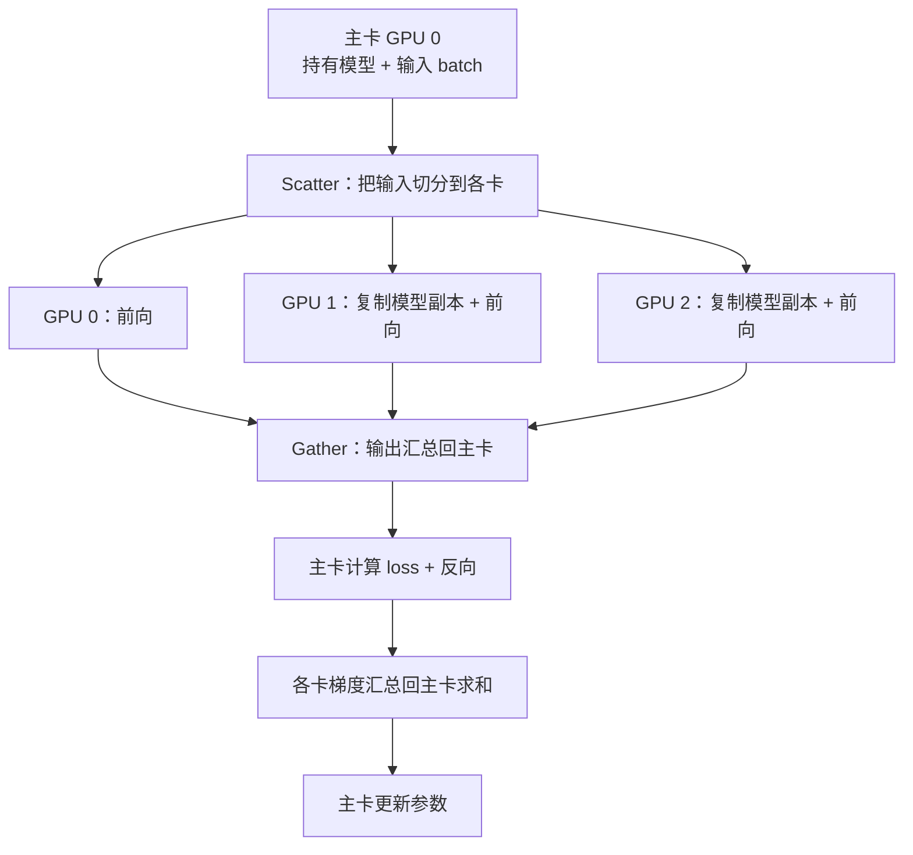
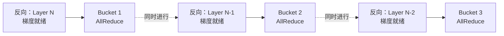
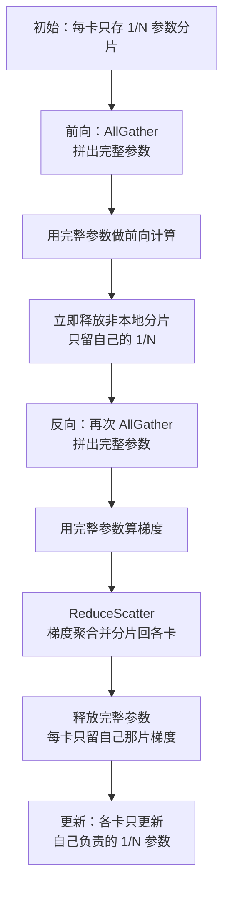
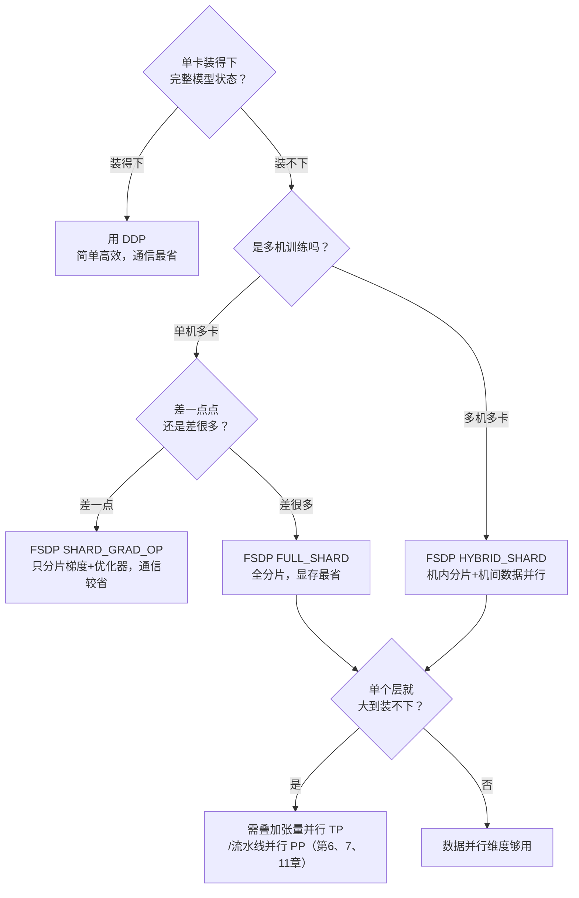

数据并行是分布式训练里最先接触、也最常用的一招：让每块 GPU 各算一部分数据，再把结果对齐。听起来简单，但从最早的 `DataParallel` 到今天的 `FSDP`，中间经历了三代演进，每一代都在回答同一个问题——"如何在保证数学等价的前提下，让更多卡、更大的模型跑起来"。本文不讲代码（实战代码见 **4.2**），而是把三代方案的**原理、梯度同步机制、通信量与显存账本**彻底讲透，让你知其然更知其所以然。

<!-- more -->

## 📑 目录

- [1. 数据并行要解决什么问题](#1-数据并行要解决什么问题)
- [2. 数据并行的数学基础](#2-数据并行的数学基础)
- [3. 第一代：DataParallel（DP）](#3-第一代dataparalleldp)
- [4. 第二代：DistributedDataParallel（DDP）](#4-第二代distributeddataparallelddp)
- [5. AllReduce 通信量的数学推导](#5-allreduce-通信量的数学推导)
- [6. 第三代：FullyShardedDataParallel（FSDP）](#6-第三代fullyshardeddataparallelfsdp)
- [7. 显存账本：三代方案的定量对比](#7-显存账本三代方案的定量对比)
- [8. 通信量对比：DDP vs FSDP](#8-通信量对比ddp-vs-fsdp)
- [9. 选型决策指南](#9-选型决策指南)
- [总结](#-总结)
- [自我检验清单](#-自我检验清单)
- [参考资料](#-参考资料)

---

## 1. 数据并行要解决什么问题

先厘清一件事：分布式训练里有很多种"并行"，它们解决的痛点并不一样。数据并行专门瞄准的是**训练太慢**——数据量太大，单卡一个 epoch 要跑很久。

打个比方：一个班有 6000 份试卷要批改，一位老师批完要一周。数据并行的做法是找来 6 位老师，每人分 1000 份同时批，一天就能收工。前提是——**每位老师手里都得有一份完整的评分标准**（即完整的模型副本），批完后大家还要**对齐评分尺度**（同步梯度），保证不会出现"张老师给分松、李老师给分紧"的情况。

用技术语言重述这套流程：

1. 每块 GPU 持有一份**完整的模型副本**（参数完全相同）
2. 把一个大 batch 的数据**均匀切分**到各 GPU，每卡只算自己那一份（称为 local batch）
3. 各 GPU **独立**做前向和反向，算出各自的梯度
4. 通过通信把所有卡的梯度**取平均**，让每块卡拿到完全一致的梯度
5. 每块卡用这份一致的梯度更新参数——更新后所有副本依然完全相同

📌 **关键点**：数据并行的核心约束是 **每卡都要装得下完整模型**。它加速了训练，但没有减少单卡的显存负担。这正是后面 FSDP 要突破的地方——当模型大到单卡装不下时，纯数据并行就无能为力了，必须引入参数分片。

💡 **提示**：分布式训练要解决的是两类正交的问题——**跑不完**（时间太长，数据并行的主场）和**装不下**（显存不足，需要 ZeRO/FSDP、张量并行、流水线并行）。本文聚焦数据并行这一维度，以及它如何逐步拥有解决显存问题的能力。

---

## 2. 数据并行的数学基础

数据并行不是"差不多就行"的近似技巧，它在数学上与单卡训练**严格等价**（在同步 SGD 下）。理解这一点，才能明白为什么梯度必须"取平均"而不是"求和"。

考虑一个 batch 的损失，通常定义为样本损失的平均值。设全局 batch 大小为 $B$，损失函数为：

$$
L = \frac{1}{B} \sum_{i=1}^{B} \ell(x_i; \theta)
$$

其中 $\ell(x_i; \theta)$ 是第 $i$ 个样本的损失，$\theta$ 是模型参数。对参数求梯度：

$$
g = \nabla_\theta L = \frac{1}{B} \sum_{i=1}^{B} \nabla_\theta \ell(x_i; \theta)
$$

现在把 $B$ 个样本均匀分给 $N$ 块 GPU，每卡分到 $\frac{B}{N}$ 个样本。第 $k$ 块卡在自己的数据分片上算出的**本地梯度**（注意它内部也做了平均）为：

$$
g_k = \frac{N}{B} \sum_{i \in \mathcal{D}\_k} \nabla_\theta \ell(x_i; \theta)
$$

其中 $\mathcal{D}\_k$ 是第 $k$ 块卡分到的样本集合。把所有卡的本地梯度**取平均**：

$$
\bar{g} = \frac{1}{N} \sum_{k=1}^{N} g_k = \frac{1}{N} \sum_{k=1}^{N} \frac{N}{B} \sum_{i \in \mathcal{D}\_k} \nabla_\theta \ell(x_i; \theta) = \frac{1}{B} \sum_{i=1}^{B} \nabla_\theta \ell(x_i; \theta) = g
$$

🔑 **核心概念**：$N$ 卡数据并行的平均梯度 $\bar{g}$ **精确等于**单卡在全局 batch 上的梯度 $g$。所以数据并行 = 用更多卡分摊计算，但每一步的参数更新与"单卡跑一个 $B$ 大小的 batch"在数学上一模一样。

这个推导带出两个实践结论：

- **为什么梯度要 AllReduce 求平均，而不是求和**：因为每卡的本地损失已经在 local batch 内做过平均（除以 $\frac{B}{N}$），跨卡再对 $N$ 个本地梯度求平均，才能还原出全局 batch 的平均梯度。如果求和，等价于把学习率放大了 $N$ 倍。
- **有效 batch size 变大了**：数据并行的有效 batch size = 单卡 local batch × $N$。这也是为什么扩大卡数时通常要相应调整学习率（详见 4.2 的学习率缩放部分）。

⚠️ **注意**：这个"严格等价"只在同步梯度、且各卡 local batch 大小相同的前提下成立。如果各卡数据条数不均（最后一个 batch 不满）、或用了异步更新，等价性会被打破。

---

## 3. 第一代：DataParallel（DP）

`torch.nn.DataParallel`（简称 DP）是 PyTorch 最早提供的多卡方案。它的最大卖点是"改一行代码就能多卡"——`model = nn.DataParallel(model)`。但它是**单进程多线程**架构，今天已被官方标记为不推荐，理解它主要是为了看清后面 DDP 为什么那样设计。

### 3.1 DP 的工作流程

DP 用一个进程管理所有 GPU，训练时反复做"分发—收集"：

关键点在于：**每一次迭代**，主卡都要把模型参数复制（replicate）到其他卡，前向的输出又要 Gather 回主卡算 loss，梯度再汇总回主卡更新。主卡既当调度者又当计算者，负担明显更重。

### 3.2 DP 的三个致命缺陷

| ❌ 缺陷 | 📝 原因 |
|---|---|
| **GIL 限制** | 单进程多线程，Python 全局解释器锁让多线程无法真正并行调度，CPU 侧成为瓶颈 |
| **负载不均** | 主卡额外承担 Scatter/Gather、loss 计算、梯度汇总，显存和算力压力都比其他卡大 |
| **通信低效** | 每步都要重新复制模型；数据走主卡中转，容易挤在 PCIe 上而非高速的 NVLink |

⚠️ **注意**：DP 常见的报错就是"主卡 OOM 而其他卡显存还很空"——因为输出汇总和 loss 计算都堆在主卡。生产环境请直接用 DDP，DP 仅适合单机上快速验证"能不能多卡跑通"。

📌 **关键点**：DP 的病根在于**单进程 + 主卡中心化**。DDP 的所有改进，本质上都是在拆掉这两个前提——改成多进程、去中心化。

---

## 4. 第二代：DistributedDataParallel（DDP）

DDP（DistributedDataParallel）是当前生产环境数据并行的**事实标准**。它的核心变革是：**每块 GPU 一个独立进程**，各进程持有自己的完整模型副本，彼此地位对等——没有"主卡"，梯度同步走**去中心化的 AllReduce**。

### 4.1 从"中心化"到"去中心化"

对比 DP 就能看出 DDP 好在哪：

| 📊 维度 | DataParallel（DP） | DistributedDataParallel（DDP） |
|---|---|---|
| 进程模型 | 单进程多线程 | 每卡一个进程，无 GIL 争抢 |
| 模型副本 | 每步重新 replicate | 只在初始化时 Broadcast 一次 |
| 梯度同步 | 汇总到主卡求和 | 去中心化 AllReduce，各卡对等 |
| 负载 | 主卡偏重 | 各卡均衡 |
| 通信路径 | 经主卡中转 | 点对点 Ring，充分利用 NVLink |

DDP 的生命周期可以概括为"一次广播，多次同步"：

1. **初始化**：构造 DDP 时，把 rank 0 的参数 **Broadcast** 到所有进程，保证所有副本起点完全一致
2. **前向 + 反向**：每个进程在自己的数据分片上**独立**计算，互不通信
3. **梯度同步**：反向传播过程中，通过 **AllReduce** 把各进程的梯度取平均，同步后各卡梯度一致
4. **参数更新**：各进程用一致的梯度独立更新——因为起点一致、梯度一致，更新后依然一致

🔑 **核心概念**：DDP 全程只在**初始化广播**和**反向的梯度 AllReduce** 两处通信。前向完全无通信，这是它比 DP 高效的根本原因。

### 4.2 Bucket 机制：让通信藏进计算里

这是 DDP 性能优化的精髓。最朴素的做法是：等整个反向传播算完所有梯度，再统一发起一次 AllReduce。但这样有个大问题——**通信时 GPU 在干等**，算力被浪费。

DDP 的巧思是利用反向传播的特性：反向是**从最后一层往前**逐层算的，靠后的层梯度先就绪。既然如此，为什么要等全部算完？

于是 DDP 把参数梯度按反向计算顺序打包成若干 **Bucket**（桶，默认约 25 MB 一个）。规则是：

- 某个 Bucket 里的所有梯度都就绪了，**立即**对这个 Bucket 发起 AllReduce
- 与此同时，更靠前的层还在继续算反向

这样通信和计算就**重叠（overlap）** 起来了：

💡 **提示**：Bucket 大小是可调的（`bucket_cap_mb`）。桶太小→通信次数多、每次 AllReduce 的固定开销占比高；桶太大→重叠效果差（要等更久才凑满一桶）。默认值对大多数模型够用，只有在极端网络环境下才需要调。

⚠️ **注意**：如果模型里有参数**没有参与前向计算**（比如条件分支下某些层没被走到），它们的梯度永远不就绪，对应的 Bucket 永远等不满，AllReduce 就会卡住导致死锁。这时需要设置 `find_unused_parameters=True`，让 DDP 主动标记未使用的参数。但这个选项有额外开销，能避免则避免。

### 4.3 DDP 的根本局限

DDP 简单、高效、数学严格等价，但它继承了数据并行的天生约束——**每块 GPU 都要装下完整的"参数 + 梯度 + 优化器状态\"**。

对一个 $\Psi$ 参数量的模型，用混合精度 + Adam 训练时，单卡显存里要放（按 ZeRO 论文的经典估算，单位 Byte/参数）：

- FP16 参数：$2\Psi$
- FP16 梯度：$2\Psi$
- FP32 优化器状态（master 权重 + 一阶动量 + 二阶动量）：$12\Psi$

合计约 $16\Psi$。对 7B 模型就是约 112 GB——**单张 80 GB 的 H100 直接装不下**。无论加多少卡，DDP 都救不了这个数字，因为每卡的这份账是完全冗余的。

📌 **关键点**：DDP 增加卡数只能**摊薄计算时间**（更快），不能**摊薄单卡显存**（更省）。要突破单卡显存墙，就要问：这份 $16\Psi$ 的冗余，能不能也切开分给各卡？——这正是 FSDP 的出发点。

---

## 5. AllReduce 通信量的数学推导

很多教程直接抛出"DDP 每步通信量是 $2\Psi$"这个结论，但不解释怎么来的。搞懂这个推导，才能真正理解为什么 Ring AllReduce 是**带宽最优**的，以及后面 FSDP 的 $3\Psi$ 是怎么算出来的。

### 5.1 AllReduce = ReduceScatter + AllGather

先记住一个关键等式：**一次 AllReduce 在实现上等于一次 ReduceScatter 加一次 AllGather**。

- **ReduceScatter**：把每卡的数据分成 $N$ 块，跨卡对相同位置的块做聚合（求和），最后每卡拿到**一块**已经聚合完成的结果
- **AllGather**：每卡把自己那块结果广播出去，最后所有卡都拿到**完整**的聚合结果

用图书馆盘点打比方：$N$ 个管理员每人手上有全馆图书的一份清点记录。ReduceScatter 阶段，把书架分成 $N$ 区，1 号管理员负责汇总所有人 A 区的数据、2 号汇总 B 区……盘完后每人手里只有自己那一区的最终总数；AllGather 阶段，大家再互相通报自己区的总数，最后每人都拿到全馆的完整总数。

### 5.2 Ring AllReduce 的通信量

Ring AllReduce 把 $N$ 块卡组成一个环，数据切成 $N$ 份，流水线式地在环上传递。设梯度总大小为 $\Psi$（这里用参数个数近似数据量，实际字节数要再乘以 dtype 大小）。

**ReduceScatter 阶段**：需要 $N-1$ 步，每步每卡向下一个邻居发送 $\frac{\Psi}{N}$ 大小的数据。每卡发送总量：

$$
(N-1) \times \frac{\Psi}{N}
$$

**AllGather 阶段**：同样 $N-1$ 步，每步每卡发送 $\frac{\Psi}{N}$，每卡发送总量同上，也是 $(N-1) \times \frac{\Psi}{N}$。

两阶段相加，每卡**发送**的总数据量为：

$$
2 \times (N-1) \times \frac{\Psi}{N} = 2\Psi \cdot \frac{N-1}{N}
$$

🔑 **核心概念**：当卡数 $N$ 很大时，$\frac{N-1}{N} \to 1$，所以每卡的通信量趋近于 $2\Psi$，且**与卡数 $N$ 无关**。这正是 Ring AllReduce 的精妙之处——加再多卡，单卡的通信负担也不会膨胀。这就是"DDP 每步通信量 $2\Psi$"的出处。

### 5.3 为什么不用"汇总到一张卡"的朴素做法

假如用 DP 那种中心化方式——所有卡把梯度发给主卡求和，主卡再广播回去——主卡的收发量是 $2(N-1)\Psi$，随 $N$ 线性增长。主卡带宽立刻成为瓶颈。

| 📊 方案 | 单卡通信量 | 是否随 N 膨胀 |
|---|---|---|
| 中心化汇总（DP 式） | 主卡 $2(N-1)\Psi$ | ❌ 主卡线性膨胀，成瓶颈 |
| Ring AllReduce（DDP） | $2\Psi \cdot \frac{N-1}{N} \approx 2\Psi$ | ✅ 恒定，与 N 无关 |

💡 **提示**：这就是集合通信原语的价值所在——不是简单的"发消息"，而是通过精心设计的通信模式，把带宽压力均摊到所有节点。关于 Ring AllReduce、Halving-Doubling 等算法的更细致分析，参见 **第2章：集合通信原语**。

⚠️ **注意**：$2\Psi$ 是**理想 Ring** 下的带宽下界。实际通信量还受拓扑（NVLink vs PCIe vs 跨机 InfiniBand）、消息大小、NCCL 具体算法选择影响。跨机训练时，机间带宽通常远低于机内，往往成为整体瓶颈。

---

## 6. 第三代：FullyShardedDataParallel（FSDP）

回到 DDP 的痛点：每卡冗余存了一份 $16\Psi$ 的完整状态。FSDP（FullyShardedDataParallel）的答案简单而彻底——**别冗余存了，把参数、梯度、优化器状态都切成 $N$ 份，每卡只存 $\frac{1}{N}$，需要用的时候再临时拼出来**。它是 PyTorch 对 DeepSpeed ZeRO 思想的原生实现。

### 6.1 FSDP 的执行方式

DDP 中每卡始终持有完整的参数、梯度和优化器状态，各卡之间完全冗余。FSDP 将这三类数据按卡数 $N$ 均匀切片，每卡只持久保存属于自己的那 $\frac{1}{N}$。计算某一层时，通过 AllGather 临时收集所有卡的分片、拼成完整参数；计算结束后立即释放其他卡的部分，显存回落到分片大小。梯度在反向传播后通过 ReduceScatter 聚合，每卡只保留本分片对应的梯度；优化器更新同样只在本分片上执行。

用 ZeRO 的语言，冗余可以分三层逐步消除：

| 📊 ZeRO 阶段 | 分片内容 | 每卡显存（$\Psi$ 参数，$N$ 卡） | 对应 FSDP 策略 |
|---|---|---|---|
| **Stage 1** | 优化器状态 | $2\Psi + 2\Psi + \frac{12\Psi}{N}$ | （包含在 `SHARD_GRAD_OP` 内） |
| **Stage 2** | + 梯度 | $2\Psi + \frac{14\Psi}{N}$ | `SHARD_GRAD_OP` |
| **Stage 3** | + 参数 | $\frac{16\Psi}{N}$ | `FULL_SHARD` |

🔑 **核心概念**：Stage 3（FULL_SHARD）把全部 $16\Psi$ 都切开，单卡显存降到 $\frac{16\Psi}{N}$。以 7B 模型、8 卡为例：DDP 每卡约 112 GB（装不下），FSDP FULL_SHARD 每卡约 $\frac{112}{8} = 14$ GB（轻松装下）。这就是 FSDP 能训练"单卡装不下的模型"的原因。

### 6.2 FSDP 的执行流程：AllGather + ReduceScatter

FSDP 比 DDP 复杂，核心是围绕每个分片单元（FSDP unit，通常是一个 Transformer Block）做"按需组装、用完即弃"。以一个 unit 的前向 + 反向为例：

拆开看两个关键通信：

- **前向的 AllGather**：算某个 unit 前，把散落各卡的参数分片收集起来，临时拼成完整参数。算完立刻扔掉非本地部分。
- **反向的 AllGather + ReduceScatter**：反向要再拼一次完整参数（因为前向后已经释放了）算出完整梯度；然后用 **ReduceScatter**，一步同时完成"梯度聚合"和"分片回各卡"——每卡最终只拿到自己负责那一片的聚合梯度。

📌 **关键点**：注意反向的梯度同步用的是 **ReduceScatter** 而非 DDP 的 AllReduce。因为 FSDP 每卡只需更新自己的分片，所以只需拿到"自己那片"的聚合梯度就够了，不必像 DDP 那样让每卡都拿到完整梯度。这个差异直接决定了两者通信量的不同（下一节推导）。

### 6.3 FSDP 的四种分片策略

FSDP 用 `sharding_strategy` 控制切到什么程度，是一个"显存 vs 通信"的权衡旋钮：

| 📊 策略 | 分片内容 | 显存节省 | 通信开销 | 适用场景 |
|---|---|---|---|---|
| `FULL_SHARD` | 参数 + 梯度 + 优化器（ZeRO-3） | 最高 | 最高 | 大模型，显存紧张 |
| `SHARD_GRAD_OP` | 梯度 + 优化器状态（ZeRO-2，参数不分片） | 中等 | 中等 | 中等模型，想省通信 |
| `HYBRID_SHARD` | 机内 FULL_SHARD + 机间数据并行 | 高 | 机间较低 | 多机训练首选 |
| `NO_SHARD` | 不分片（等价 DDP） | 无 | 最低 | 调试对照 |

💡 **提示**：`HYBRID_SHARD` 是多机大模型的推荐策略。它的洞察是——机内有高带宽的 NVLink，适合做通信密集的 FULL_SHARD；机间只有较慢的 InfiniBand，就退化成通信量小的数据并行（AllReduce）。相当于把"高频通信"关在机内，"低频通信"才跨机，是显存与通信的最佳折中。

### 6.4 FSDP2：下一代 API

PyTorch 正在推进新一代 API `fully_shard`（俗称 FSDP2）。与 FSDP1 的"整个模块打包分片"（module-wrapper）不同，FSDP2 采用 **per-parameter 分片**，底层基于 `DTensor`（Distributed Tensor）抽象。它的主要优势：

- 分片粒度到单个参数，更灵活，避免整块打包带来的显存/通信浪费
- 基于 DTensor，与张量并行（TP）、序列并行等**组合**时接口更统一，是搭建 2D/3D 并行的基础
- 更清晰的初始化与 checkpoint 语义

💡 **提示**：截至 PyTorch 2.x，FSDP2 已可用且是官方主推方向，但仍在快速迭代。新项目值得尝试 FSDP2（尤其要和 TP 组合时），追求稳定的存量生产项目 FSDP1 仍是稳妥选择。具体代码见 4.2。

---

## 7. 显存账本：三代方案的定量对比

把显存账彻底算清楚，选型时才有底气。沿用混合精度 + Adam 的经典估算，对 $\Psi$ 参数量的模型，"模型状态"（不含激活值）分为四部分：

$$
\underbrace{2\Psi}\_{\text{FP16 参数}} + \underbrace{2\Psi}\_{\text{FP16 梯度}} + \underbrace{4\Psi}\_{\text{FP32 master 权重}} + \underbrace{4\Psi + 4\Psi}\_{\text{Adam 动量}} = 16\Psi
$$

其中后三项（master 权重 + 一阶动量 + 二阶动量，共 $12\Psi$）合称**优化器状态**。基于这个 $16\Psi$，三代方案的单卡模型状态显存如下（$N$ 为卡数）：

| 📊 方案 | 参数 | 梯度 | 优化器状态 | 单卡合计 | $N=8$ 时（7B 模型） |
|---|---|---|---|---|---|
| **DDP** | $2\Psi$ | $2\Psi$ | $12\Psi$ | $16\Psi$ | ~112 GB |
| **FSDP SHARD_GRAD_OP**（ZeRO-2） | $2\Psi$ | $\frac{2\Psi}{N}$ | $\frac{12\Psi}{N}$ | $2\Psi + \frac{14\Psi}{N}$ | ~26 GB |
| **FSDP FULL_SHARD**（ZeRO-3） | $\frac{2\Psi}{N}$ | $\frac{2\Psi}{N}$ | $\frac{12\Psi}{N}$ | $\frac{16\Psi}{N}$ | ~14 GB |

（7B 即 $\Psi = 7\times10^9$，$16\Psi \approx 112$ GB；$N=8$。）

从这张表能读出几个结论：

- **DDP 的显存与卡数无关**：加卡不减负，$16\Psi$ 恒定。这是它的天花板。
- **优化器状态是最大头**（$12\Psi$，占 75\%）：所以 ZeRO-1/2 只分片优化器状态和梯度就能省掉大半，性价比很高。
- **FULL_SHARD 随卡数线性下降**：卡越多，单卡越省，理论上能训练任意大的模型（只要卡够多）。

⚠️ **注意**：这张表只算了**模型状态**，没算**激活值**（activation）。激活值随 batch size、序列长度、模型深度增长，长序列训练时往往才是显存的大头。FSDP 分片的是模型状态，对激活值无能为力——那需要 Activation Checkpointing、序列并行等手段（见 **第8章、第9章**）。

💡 **提示**：实际选型时，先用这个公式估出模型状态占多少，再留出激活值和碎片的余量（经验上给峰值再乘 1.2~1.5）。如果 DDP 的 $16\Psi$ 加激活值超过单卡容量，就往 FSDP 走；优先试 `SHARD_GRAD_OP`（通信更省），还不够再上 `FULL_SHARD`。

---

## 8. 通信量对比：DDP vs FSDP

省显存不是免费的——FSDP 用**更多通信**换来了**更少显存**。把这笔账算清楚，就明白为什么"单卡装得下时不该硬上 FSDP"。

### 8.1 DDP：每步 $2\Psi$

前面第 5 节已经推导过：DDP 每步做一次 AllReduce 同步梯度，单卡通信量约 $2\Psi$。这是数据并行通信量的基准线。

### 8.2 FSDP：每步 $3\Psi$

FSDP 每步的通信拆成三块（回顾 6.2 的流程）：

- **前向 AllGather**：拼出完整参数。AllGather 单卡通信量约 $\Psi$
- **反向 AllGather**：反向前再拼一次参数（前向后已释放）。约 $\Psi$
- **反向 ReduceScatter**：同步并分片梯度。ReduceScatter 单卡通信量约 $\Psi$

合计约 $3\Psi$，比 DDP 的 $2\Psi$ **多出 50\%**。

📌 **关键点**：为什么 AllReduce 是 $2\Psi$，而 AllGather 或 ReduceScatter 各只是 $\Psi$？因为 AllReduce = ReduceScatter + AllGather（第 5.1 节的等式），本身就是两个 $\Psi$ 操作的组合。FSDP 把这两半拆开用，再额外多一次前向 AllGather，所以是 $\Psi + \Psi + \Psi = 3\Psi$。

### 8.3 汇总对比

| 📊 维度 | DDP | FSDP（FULL_SHARD） |
|---|---|---|
| 核心思路 | 每卡完整模型，梯度 AllReduce | 参数分片，按需 AllGather |
| 每卡通信量/步 | $2\Psi$ | $3\Psi$（多 50\%） |
| 通信时机 | 反向时一次 AllReduce | 每个 unit：前向 AllGather + 反向 AllGather + ReduceScatter |
| 单卡显存 | $16\Psi$ | $\frac{16\Psi}{N}$ |
| 计算通信重叠 | Bucket 机制 | prefetch 预取下一层参数 |

🔑 **核心概念**：DDP 和 FSDP 是一组清晰的**权衡对偶**——DDP 省通信（$2\Psi$）但费显存（$16\Psi$）；FSDP 省显存（$\frac{16\Psi}{N}$）但费通信（$3\Psi$）。没有免费午餐，选哪个取决于你的瓶颈是显存还是通信/吞吐。

⚠️ **注意**：FSDP 多出的通信能否被计算掩盖，很依赖网络带宽和 prefetch 效果。在高带宽机内（NVLink/NVSwitch），$3\Psi$ 的额外通信基本能被重叠掉，吞吐损失不大；但在低带宽的跨机场景，FSDP 的通信可能暴露成为瓶颈——这正是 `HYBRID_SHARD` 存在的意义。

---

## 9. 选型决策指南

把前面的显存账和通信账合起来，就能给出一条清晰的决策路径。核心问题只有一个：**参数 + 梯度 + 优化器状态 + 激活值 单卡装得下吗**

落成一句话的规则：

- ✅ **单卡装得下** → 用 DDP。别为了"显得高级"上 FSDP，白白多付 50\% 通信。
- ✅ **单卡差一点装不下** → 优先 FSDP `SHARD_GRAD_OP`（ZeRO-2），通信比 FULL_SHARD 省。
- ✅ **单卡差很多** → FSDP `FULL_SHARD`（ZeRO-3），显存最省。
- ✅ **多机 + 大模型** → FSDP `HYBRID_SHARD`，避免慢速跨机链路上跑高频通信。
- ✅ **单个层都装不下**（如超大 Embedding 或 FFN） → 数据并行这条维度到头了，要叠加张量并行（TP）、流水线并行（PP），走向 3D 并行（见第 6、7、11 章）。

💡 **提示**：数据并行是并行策略的"第一维度"，也是几乎所有大模型训练的基础层。真正的超大规模训练（千亿参数以上）从来不是单靠数据并行，而是 DP + TP + PP 的组合。但无论组合多复杂，理解本章讲的"梯度同步"和"参数分片"两条主线，都是往上叠加其他并行策略的前提。

---

## 📝 总结

本文沿着"为什么演进"的主线，把数据并行三代方案讲透：

- **数据并行的本质**：用多卡分摊数据、加速训练，数学上与单卡训练严格等价（梯度取平均 = 单卡全局 batch 梯度）。核心约束是每卡都要装下完整模型。
- **DP → DDP**：DP 单进程 + 主卡中心化，受 GIL、负载不均、通信低效三重拖累；DDP 改为每卡一进程、去中心化 AllReduce，并用 **Bucket 机制**把通信藏进反向计算里实现重叠。
- **AllReduce = ReduceScatter + AllGather**：Ring AllReduce 每卡通信量约 $2\Psi$ 且与卡数无关，这是理解 DDP 与 FSDP 通信差异的钥匙。
- **DDP → FSDP**：DDP 每卡冗余存 $16\Psi$ 撞上单卡显存墙；FSDP 借鉴 ZeRO，把参数/梯度/优化器分片存储、按需 AllGather 组装，单卡显存降到 $\frac{16\Psi}{N}$。
- **两笔账**：显存上 DDP 恒定 $16\Psi$、FSDP FULL_SHARD 为 $\frac{16\Psi}{N}$；通信上 DDP 是 $2\Psi$、FSDP 是 $3\Psi$。这是一组"省显存 vs 省通信"的权衡对偶。
- **选型**：单卡装得下用 DDP；装不下按缺口大小选 `SHARD_GRAD_OP` / `FULL_SHARD`；多机用 `HYBRID_SHARD`；单层都装不下则需叠加 TP/PP。

掌握了这些原理，就可以进入 **4.2《PyTorch 数据并行从原理到实战》**，把这套理论落成可运行的 DDP/FSDP 代码、多机启动脚本与踩坑排查。

---

## 🎯 自我检验清单

- 能推导数据并行的平均梯度为什么严格等于单卡全局 batch 梯度，并解释梯度为何要"求平均"而非"求和"
- 能说清 DP 的三个致命缺陷，以及 DDP 分别是如何针对性解决的
- 能解释 DDP 的 Bucket 机制如何实现计算与通信的重叠，以及 `find_unused_parameters` 的作用
- 能写出 AllReduce = ReduceScatter + AllGather 的等价关系，并推导 Ring AllReduce 单卡通信量约 $2\Psi$
- 能说出 ZeRO 三个阶段各分片了什么，分别对应 FSDP 的哪种 `sharding_strategy`
- 能画出 FSDP 一个 unit 前向 + 反向的通信流程（AllGather / ReduceScatter 出现在哪些位置）
- 能解释 FSDP 反向为什么用 ReduceScatter 而不是 AllReduce
- 能算出 DDP 和 FSDP 各分片策略下的单卡显存，并说明优化器状态为何是最大头
- 能解释 FSDP 每步通信量 $3\Psi$ 比 DDP 的 $2\Psi$ 多 50\% 的来源
- 能根据"单卡是否装得下 / 是否多机"给出 DDP、`SHARD_GRAD_OP`、`FULL_SHARD`、`HYBRID_SHARD` 的选型决策

---

## 📚 参考资料

- [PyTorch DistributedDataParallel — API 文档](https://docs.pytorch.org/docs/stable/generated/torch.nn.parallel.DistributedDataParallel.html)
- [PyTorch DDP Design Note（Bucket 与梯度同步机制）](https://docs.pytorch.org/docs/stable/notes/ddp.html)
- [PyTorch FSDP — FullyShardedDataParallel](https://docs.pytorch.org/docs/stable/fsdp.html)
- [Getting Started with Fully Sharded Data Parallel (FSDP2)](https://docs.pytorch.org/tutorials/intermediate/FSDP_tutorial.html)
- [ZeRO: Memory Optimizations Toward Training Trillion Parameter Models](https://arxiv.org/abs/1910.02054)
- [PyTorch FSDP: Experiences on Scaling Fully Sharded Data Parallel](https://arxiv.org/abs/2304.11277)
- [Bringing HPC Techniques to Deep Learning（Ring AllReduce 原理）](https://andrew.gibiansky.com/blog/machine-learning/baidu-allreduce/)
- [NCCL Documentation](https://docs.nvidia.com/deeplearning/nccl/user-guide/docs/)
