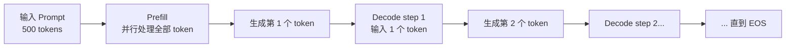
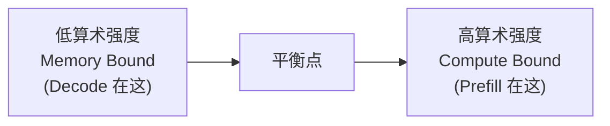
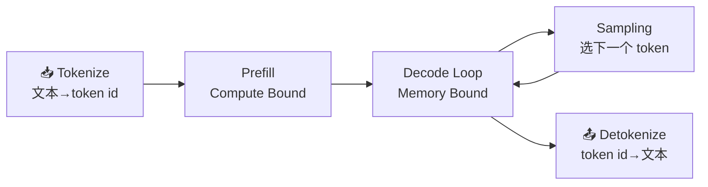

把一个训练好的大模型"搬上线"提供服务，和把它训练出来，是两件目标完全不同的事。训练追求的是把海量数据喂进去、让 Loss 收敛；而推理追求的是**在延迟和成本的约束下，尽可能快、尽可能多地生成 Token**。这一节不谈任何优化技巧，只做一件事：把 LLM 推理的底层逻辑彻底讲清楚——它分成哪两个阶段、为什么要缓存 KV、显存花在了哪里、用什么指标衡量快慢，以及一个绕不开的灵魂拷问：**为什么砸了几万块钱的 GPU，生成文字时算力却大部分在闲置？**

读完这一节，你就有了一套"坐标系"。后续每一项推理优化技术（PagedAttention、Continuous Batching、量化、投机解码……）本质上都是在这套坐标系里的某个位置动刀，理解了地基，才能看懂它们各自在解决什么问题。

<!-- more -->

## 📑 目录

- [1. 自回归生成：Prefill 与 Decode 两阶段](#1-自回归生成prefill-与-decode-两阶段)
- [2. KV Cache：用显存换计算](#2-kv-cache用显存换计算)
- [3. 关键性能指标：如何衡量"快"](#3-关键性能指标如何衡量快)
- [4. 瓶颈分析：为什么 Decode 打不满算力](#4-瓶颈分析为什么-decode-打不满算力)
- [5. 推理全链路拆解](#5-推理全链路拆解)
- [总结](#-总结)
- [自我检验清单](#-自我检验清单)
- [参考资料](#-参考资料)

---

## 1. 自回归生成：Prefill 与 Decode 两阶段

### 1.1 从"续写"理解自回归

主流的大语言模型（GPT、Llama、Qwen 等）都是 **Decoder-only 的自回归模型**。"自回归"听起来抽象，其实就是**一次只预测下一个词，然后把预测出来的词接到输入末尾，再预测下一个**——像玩接龙一样，把刚说出口的字重新当成线索，猜下一个字。

用一句话概括生成过程：给定已有的 Token 序列 $x_1, x_2, \dots, x_t$，模型输出下一个 Token 的概率分布，采样得到 $x_{t+1}$，再把它拼回去继续。

$$
x_{t+1} \sim P(x \mid x_1, x_2, \dots, x_t)
$$

这个"接龙"会一直进行，直到模型生成了结束符（EOS），或者达到了设定的最大长度。

📌 **关键点**：自回归的本质决定了生成是**串行**的——第 $t+1$ 个 Token 必须等第 $t$ 个 Token 算完才能开始。这个串行依赖，是后面所有延迟问题的总根源。

### 1.2 两个阶段：Prefill 和 Decode

虽然都是"跑一遍模型"，但推理过程被清晰地切成了两个计算特性截然不同的阶段。

**Prefill（预填充）阶段**：处理你输入的整段 Prompt。假设你输入了 500 个 Token 的问题，模型会把这 500 个 Token **一次性、并行地**送进网络，计算出每一层的中间结果，并生成第一个输出 Token。因为这一步要同时处理成百上千个 Token，矩阵乘法又大又密集，GPU 的算力被喂得很饱。

**Decode（解码）阶段**：从第二个输出 Token 开始，进入逐个生成的循环。每一步**只输入上一步刚生成的那 1 个 Token**，跑一遍完整的网络，吐出下一个 Token。生成 200 个 Token，就要串行地跑 200 次 Decode。

用一个类比：Prefill 像是**读题**——一口气把整道题读完，理解题意；Decode 像是**答题**——一个字一个字往外写，每写一个字都要回顾前面写过的所有内容。读题可以快速扫过，但答题只能一笔一画。

### 1.3 两阶段的计算特性对比

| 📊 维度 | Prefill 阶段 | Decode 阶段 |
|---|---|---|
| 输入 Token 数 | 整段 Prompt（几十到几千） | 每步仅 1 个 |
| 并行度 | 高，Token 间可并行 | 低，步与步之间串行 |
| 计算瓶颈 | Compute Bound（算力受限） | Memory Bound（访存受限） |
| 决定的指标 | 首 Token 延迟（TTFT） | 每 Token 延迟（TPOT） |
| 执行次数 | 1 次 | 输出长度 - 1 次 |

这张表里最反直觉的一行是**计算瓶颈**：为什么每步只算 1 个 Token 的 Decode，反而是"访存受限"、效率更低？这个问题我们留到第 4 节用 Roofline 模型正面回答，先记住这个结论——它是理解推理优化的分水岭。

---

## 2. KV Cache：用显存换计算

### 2.1 不缓存会怎样

回到自回归的串行特性。Decode 第 $t$ 步要计算 Attention，需要用当前 Token 的 Query 去和**前面所有 Token 的 Key、Value** 做注意力。问题来了：前面那些 Token 的 Key 和 Value，在上一步不是已经算过了吗？

如果什么都不缓存，每生成一个新 Token，都要把前面所有 Token 重新过一遍网络算出它们的 K、V——生成第 100 个 Token 时要重算 99 个,生成第 200 个时要重算 199 个，计算量随序列长度平方级膨胀。这显然是巨大的浪费。

💡 **提示**：**KV Cache 的核心思想就是——把已经算过的 Key 和 Value 存起来，下一步直接复用，绝不重算。** 这是一个典型的"用空间换时间"：牺牲显存，换掉大量重复计算。

注意一个不对称：Query 不需要缓存，因为每一步只用当前 Token 的 Query；而 Key、Value 是历史累积的、每步都要全量用到，所以缓存的是 K 和 V，这也是"KV Cache"名字的由来。

### 2.2 KV Cache 的生命周期

一个请求的 KV Cache 会经历四个阶段，理解这个生命周期，才能明白后续 PagedAttention 到底在优化哪一环：

📥 **分配** → ✍️ **填充** → 🔁 **使用** → 🗑️ **释放**

- **分配**：请求进来，推理引擎为它预留一块显存放 KV Cache
- **填充**：Prefill 阶段一次性把整段 Prompt 的 K、V 算出来写进缓存；Decode 每步再追加 1 个 Token 的 K、V
- **使用**：每一步 Decode 都要读取全部历史 KV 来算 Attention
- **释放**：请求生成结束（EOS 或达到长度上限），显存归还

### 2.3 显存账本：KV Cache 到底占多少

这是必须会手算的一笔账。单个 Token 在 KV Cache 中占用的字节数为：

$$
\text{per\_token\_bytes} = 2 \times L \times H_{kv} \times d_{head} \times \text{bytes}
$$

各项含义：

- $2$：分别存 Key 和 Value 两份
- $L$：Transformer 层数（每一层都有独立的 KV Cache）
- $H_{kv}$：KV 头的数量（注意是 KV 头，不是 Query 头）
- $d_{head}$：每个头的维度
- $\text{bytes}$：数据类型字节数，FP16/BF16 为 2，FP8/INT8 为 1

一个请求的总占用，再乘以序列长度和并发请求数：

$$
\text{total\_bytes} = \text{per\_token\_bytes} \times \text{seq\_len} \times \text{batch\_size}
$$

**举个具体的例子**（以一个 32 层、采用标准多头注意力即 32 个 KV 头、$d_{head}=128$、FP16 的模型为例）：

$$
\text{per\_token\_bytes} = 2 \times 32 \times 32 \times 128 \times 2 = 524288 \text{ bytes} \approx 0.5\ \text{MB}
$$

也就是说，**每生成 1 个 Token，就要多吃约 0.5 MB 显存**。当一个请求的上下文长到 4096 Token 时，光这一个请求的 KV Cache 就要吃掉约 2 GB。如果要同时服务 50 个这样的并发请求，仅 KV Cache 就是 100 GB——单张 80GB 的 GPU 直接爆掉。这就是为什么 KV Cache 的显存管理是推理优化的头号战场。

📌 **关键点**：$H_{kv}$ 在公式里是线性因子，这正是 **GQA（分组查询注意力）/ MQA（多查询注意力）** 能大幅省显存的原因——让多个 Query 头共享一组 KV 头。比如 32 个 Query 头共享 8 个 KV 头（GQA），KV Cache 直接砍到原来的 $1/4$，而模型表达能力几乎不受影响。现代大模型几乎清一色采用 GQA，就是这笔账算出来的。

### 2.4 碎片化问题

KV Cache 还有一个隐蔽的坑：**你事先不知道一个请求会生成多长**。传统做法是按"最大可能长度"预留一整块连续显存，就像餐厅不管来几个人，都先给你留一张最大的桌子。结果是：请求实际只生成了 100 个 Token，却按 2048 预留，剩下的座位全部空占——这叫**内部碎片**；不同请求预留块之间的空隙又凑不成一整块可用空间——这叫**外部碎片**。

⚠️ **注意**：碎片化会让 KV Cache 的实际显存利用率大打折扣，大量显存被无效预留白白浪费。这正是 vLLM 的 PagedAttention 要解决的核心问题——它把连续大块换成了操作系统式的分页管理（下一章详解）。

---

## 3. 关键性能指标：如何衡量"快"

推理服务的"快"不是一个数字能说清的。用户体验、集群成本、SLA 承诺，分别对应不同的指标。搞混它们，优化就会跑偏。

### 3.1 延迟类指标：用户等多久

**TTFT（Time To First Token，首 Token 延迟）**：从用户提交请求到收到第一个 Token 的时间。它主要由**排队时间 + Prefill 时间 + 网络延迟**构成，Prompt 越长，Prefill 越久，TTFT 越大。对于聊天、流式输出这类场景，TTFT 直接决定"响应快不快"的第一印象。

**TPOT（Time Per Output Token，每 Token 延迟）**，又称 **ITL（Inter-Token Latency，Token 间延迟）**：生成阶段平均每个输出 Token 花的时间。它决定了文字"往外蹦"的速度——TPOT 是 50ms，用户看到的就是每秒约 20 个字的吐字速度。

💡 **提示**：TPOT 和 ITL 在多数语境下是同义词，都指 Decode 阶段的平均出字间隔。细微差别只在于**计算时是否把首 Token 那一段算进去**——NVIDIA GenAI-Perf 的做法是排除首 Token，即 $\text{ITL} = (\text{e2e\_latency} - \text{TTFT}) / (\text{输出 Token 数} - 1)$。

**端到端延迟（E2E Latency）**：从提交请求到收到完整响应的总时间。它可以拆成：

$$
\text{E2E} = \text{TTFT} + \text{TPOT} \times (\text{输出 Token 数} - 1)
$$

这个公式非常实用——它告诉你：**短输出场景 TTFT 主导，长输出场景 TPOT 主导**。优化时要看清自己的业务落在哪一侧。

### 3.2 吞吐类指标：机器能扛多少

**Throughput（吞吐量）**通常有两种口径：

| 📊 指标 | 📝 含义 | 适用视角 |
|---|---|---|
| Token/s（系统） | 全系统每秒生成的总 Token 数 | 衡量集群整体产能与成本 |
| Token/s（单用户） | 单个用户感受到的出字速度 | 约等于 $1 / \text{TPOT}$ |
| RPS（Requests/s） | 每秒成功完成的请求数 | 衡量并发承载能力 |

系统吞吐会随并发上升而增长，直到 GPU 资源饱和后趋于平稳甚至回落。**吞吐和延迟通常是一对矛盾**：把更多请求塞进一个 Batch 能提高系统吞吐，但每个请求的排队和计算时间变长，单用户延迟变差。

### 3.3 尾延迟与 Goodput：别被平均值骗了

平均延迟是最容易骗人的指标。真实流量下，少数请求可能慢得离谱，而平均值把它们藏了起来。所以生产环境更看**尾延迟**：

- **P50**：中位数，一半请求比它快
- **P95 / P99**：95% / 99% 的请求比它快——这才是用户投诉的来源

📌 **关键点**：**Goodput（有效吞吐）** 是比 Raw QPS 更贴近真实价值的指标。它只统计**满足 SLO（比如 TTFT < 1s 且 TPOT < 50ms）的那部分请求的吞吐**。一个系统 QPS 很高但大部分请求都超时，Goodput 就很低——用户根本用不爽。后面第 7 章的 P/D 解耦、SLO 感知调度，优化目标正是 Goodput。

---

## 4. 瓶颈分析：为什么 Decode 打不满算力

现在回答第 1 节埋下的问题。这是整个推理优化最重要的第一性原理，值得单独一节讲透。

### 4.1 算术强度：计算与访存的比值

GPU 干活要同时做两件事：从显存（HBM）**搬数据**，和用计算单元**算数据**。谁慢谁就是瓶颈。衡量一个任务"偏计算还是偏访存"，用**算术强度（Arithmetic Intensity）**：

$$
\text{算术强度} = \frac{\text{浮点运算次数 (FLOPs)}}{\text{访存字节数 (Bytes)}}
$$

直白理解：**每从显存搬 1 个字节的数据，能顺带做多少次计算**。这个比值高，说明数据搬来后被充分利用，算力吃得饱；比值低，说明算力在干等数据，大部分时间浪费在搬运上。

### 4.2 Roofline 模型：一张图看懂瓶颈

Roofline 模型把这件事画成一张图：横轴是算术强度，纵轴是实际能达到的算力。图上有一条"屋顶线"——左半段是被显存带宽压住的斜坡（Memory Bound 区），右半段是被峰值算力压住的水平线（Compute Bound 区）。两段的交点，就是这块 GPU 的"平衡点"算术强度。

一个任务落在斜坡上（算术强度低于平衡点），瓶颈就是显存带宽，无论 GPU 算力多强都用不上；落在水平线上，才是算力受限、真正把 GPU 榨干了。

### 4.3 把 Prefill 和 Decode 放上去

- **Prefill**：一次并行处理成百上千个 Token，权重从显存搬一次（batch 内所有 Token 共享），却要做海量矩阵乘法——算术强度**高**，落在 Compute Bound 区，GPU 算力吃得饱。
- **Decode**：每步只处理 **1 个 Token**，但为了算这 1 个 Token，得把**整个模型的权重**从显存完整搬一遍。搬了几十上百 GB 的权重，只做了一个 Token 的计算——算术强度**极低**，死死落在 Memory Bound 区。

🔑 **核心概念**：**Decode 慢，不是因为算不过来，而是因为"搬不过来"**。GPU 的计算单元大部分时间在空等权重从显存加载。这就解释了两个关键现象：

1. **为什么 Batch 能大幅提升吞吐却几乎不增加延迟**：把多个请求的 Decode 拼成一个 Batch，权重只搬一次就能服务整个 Batch 的所有 Token，算术强度成倍提升，把闲置的算力利用起来——这正是 Continuous Batching 的理论依据。
2. **为什么量化（尤其是 Weight-only）对 Decode 加速明显**：Decode 瓶颈在搬权重，把权重从 FP16 压到 INT4，要搬的字节数直接减少到 $1/4$，延迟随之大幅下降。

理解了这一点，你就掌握了看穿几乎所有推理优化技术的"透视镜"。

---

## 5. 推理全链路拆解

最后把一个请求从进到出的完整链路走一遍，标出每个环节的计算特性，方便你日后定位瓶颈到底卡在哪。

| 环节 | 做什么 | 计算特性 | 潜在瓶颈 |
|---|---|---|---|
| Tokenize | 把输入文本切成 Token ID 序列 | CPU 任务 | 长文本或高并发时 CPU 成瓶颈 |
| Prefill | 并行处理全部 Prompt Token，产出首 Token 与初始 KV Cache | GPU，Compute Bound | Prompt 很长时拉高 TTFT |
| Decode Loop | 逐 Token 生成，每步读全量 KV、追加新 KV | GPU，Memory Bound | 显存带宽，决定 TPOT |
| Sampling | 从输出分布按 Temperature/Top-p 等采样下一个 Token | GPU，轻量 | 复杂采样或约束解码略增开销 |
| Detokenize | 把 Token ID 拼回可读文本，流式返回 | CPU 任务 | 与主循环争抢 CPU |

💡 **提示**：Tokenize / Detokenize 是 **CPU 任务**，却容易被忽视。当 GPU 优化到位后，CPU 上的这些环节反而可能成为新瓶颈——这正是 vLLM V1 引擎用多进程把它们和 GPU 核心循环重叠起来的原因（第 3 章详解）。

---

## 📝 总结

这一节我们不谈优化技巧，而是把 LLM 推理的地基铺清楚：

- **两阶段**：Prefill 并行读题（Compute Bound，决定 TTFT），Decode 串行答题（Memory Bound，决定 TPOT）。
- **KV Cache**：用显存换计算，避免重算历史 K/V；显存开销 $= 2 \times L \times H_{kv} \times d_{head} \times \text{bytes} \times \text{seq\_len}$，GQA 靠减小 $H_{kv}$ 省显存，碎片化催生了 PagedAttention。
- **性能指标**：TTFT / TPOT 分别刻画首字与出字速度，E2E $=$ TTFT $+$ TPOT $\times$ (输出长度 $-1$)；生产环境看 P95/P99 尾延迟和满足 SLO 的 Goodput。
- **瓶颈本质**：Decode 是 Memory Bound——GPU 在等权重搬运，而非算不过来。这解释了 Batching 提升吞吐、量化加速 Decode 的根本原因。

带着这套坐标系，后面每一章的优化技术都能对号入座：它在攻 TTFT 还是 TPOT？在省显存还是提吞吐？在斜坡上还是水平线上动刀？

## 🎯 自我检验清单

- 能说清 Prefill 和 Decode 两阶段在输入规模、并行度、计算瓶颈上的差异
- 能解释为什么需要 KV Cache，以及为什么只缓存 K、V 而不缓存 Q
- 能手算一个给定配置模型每 Token 的 KV Cache 显存开销
- 能说明 GQA/MQA 为什么能省 KV Cache，以及大致能省多少
- 能准确区分 TTFT、TPOT/ITL、Throughput、尾延迟和 Goodput 的含义与适用场景
- 能用 E2E 延迟公式判断某业务场景是 TTFT 主导还是 TPOT 主导
- 能用算术强度和 Roofline 解释为什么 Decode 是 Memory Bound
- 能从"Decode 卡在搬权重"推导出 Batching 提吞吐、Weight-only 量化加速 Decode 的原因
- 能画出推理全链路并指出每个环节的计算特性与潜在瓶颈

## 📚 参考资料

- [Attention Is All You Need（Transformer 原始论文）](https://arxiv.org/abs/1706.03762)
- [Efficient Memory Management for Large Language Model Serving with PagedAttention（vLLM 论文）](https://arxiv.org/abs/2309.06180)
- [GQA: Training Generalized Multi-Query Transformer Models from Multi-Head Checkpoints](https://arxiv.org/abs/2305.13245)
- [NVIDIA NIM LLM Benchmarking — Metrics](https://docs.nvidia.com/nim/benchmarking/llm/latest/metrics.html)
- [vLLM Documentation](https://docs.vllm.ai/en/latest/)
- [Roofline: An Insightful Visual Performance Model for Multicore Architectures](https://dl.acm.org/doi/10.1145/1498765.1498785)
