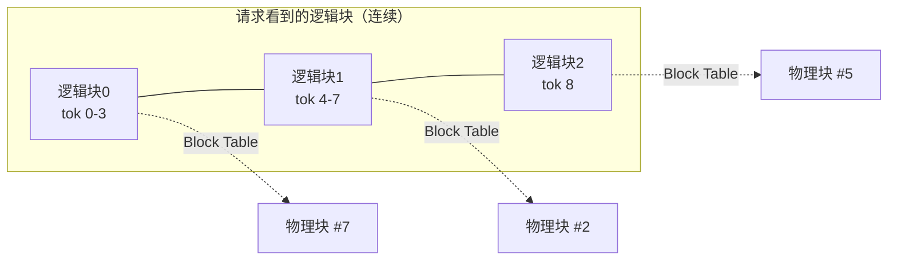
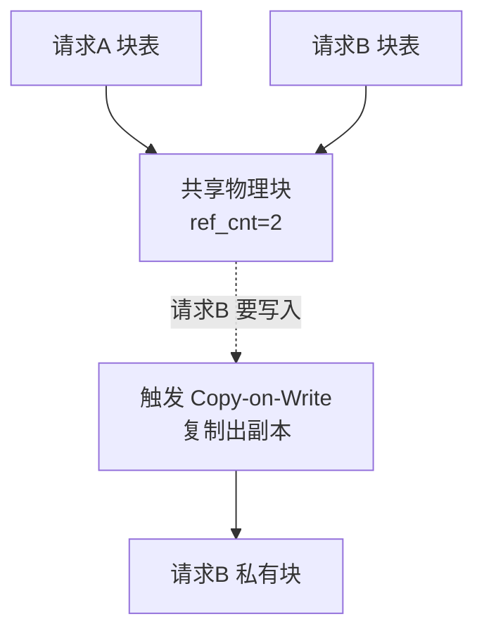

上一章的 KV Cache 显存账本留下了一个尖锐的问题：传统的连续显存分配方式，会因为"预留即浪费"产生大量碎片，实际利用率可能只有两三成。PagedAttention 就是 vLLM 用来解决这个问题的看家本领——它把操作系统管理内存的经典智慧搬到了 GPU 显存上。这一节我们把它彻底讲透：它借鉴了什么思想、Block Table 怎么工作、为什么能消灭碎片，以及它顺带解锁的前缀共享能力。

<!-- more -->

## 📑 目录

- [1. 问题回顾：连续分配的两宗罪](#1-问题回顾连续分配的两宗罪)
- [2. 核心思想：借鉴操作系统的虚拟内存分页](#2-核心思想借鉴操作系统的虚拟内存分页)
- [3. Block Table：逻辑块到物理块的映射](#3-block-table逻辑块到物理块的映射)
- [4. 分页如何消灭碎片](#4-分页如何消灭碎片)
- [5. 意外之喜：内存共享与 Copy-on-Write](#5-意外之喜内存共享与-copy-on-write)
- [6. 代价与权衡](#6-代价与权衡)
- [总结](#-总结)
- [自我检验清单](#-自我检验清单)
- [参考资料](#-参考资料)

---

## 1. 问题回顾：连续分配的两宗罪

在理解解法之前，先把问题钉死。传统推理框架（PagedAttention 出现之前）给每个请求的 KV Cache 分配的是**一整块连续显存**，而且要按"这个请求可能生成的最大长度"来预留。这带来两宗罪：

- **内部碎片（Internal Fragmentation）**：一个请求最大可能生成 2048 个 Token，就先占好 2048 个 Token 的空间，但它实际可能只生成了 100 个就遇到 EOS 停了。剩下 1948 个 Token 的空间被这个请求"锁着"却没用上，其它请求也进不来。
- **外部碎片（External Fragmentation）**：不同请求预留的大块之间会留下大小不一的空隙，这些零碎空间加起来可能不小，但因为每一块都不够放下一个完整请求，等于全废了。

用一个类比：这就像餐厅给每桌客人都按"最多可能来 10 个人"预留一张十人桌。结果大部分桌子只坐了两三个人，大量座位空着；而新来的一桌 4 人客人，却因为没有一张完整的空桌而只能在门口排队——明明加起来的空座位远够坐下他们。

📌 **关键点**：碎片的根源在于**连续 + 预留**这两个约束叠加。只要打破"必须连续"和"必须按最大长度预留"，碎片问题就迎刃而解。这正是 PagedAttention 的切入点。

---

## 2. 核心思想：借鉴操作系统的虚拟内存分页

操作系统几十年前就遇到过一模一样的问题：进程需要连续的内存地址空间，但物理内存被各种进程切得七零八落。操作系统的解法是**虚拟内存分页**——进程看到的是连续的"虚拟地址"，操作系统在背后通过页表（Page Table）把它们映射到任意分散的"物理页"上。进程感觉自己占着一整块连续内存，实际上物理上是东一块西一块拼起来的。

PagedAttention 把这套机制原样搬到了 KV Cache 上：

- 把 KV Cache 切成固定大小的 **KV Block（块）**，每个块存固定数量 Token 的 Key 和 Value（这个数量由 `block_size` 决定，vLLM 中常见取值为 16）。
- 一个请求的 KV Cache 在逻辑上是连续的"逻辑块"序列，物理上却可以散落在显存的任意位置。
- 用一张 **Block Table（块表）** 记录"这个请求的第几个逻辑块，对应物理显存里的哪一个物理块"。

🔑 **核心概念**：**PagedAttention = KV Cache 的虚拟内存分页。** Token 序列被切成块、按需分配、用块表映射，从此显存不再要求连续，也不再需要提前按最大长度预留。

💡 **提示**：vLLM 官方文档特别提醒，这里说的 KV Block 是 vLLM 自己的显存管理单位，和 CUDA 里的 "thread block（线程块）" 完全是两回事，不要混淆。

---

## 3. Block Table：逻辑块到物理块的映射

Block Table 是整个机制的枢纽。我们用一个具体的例子走一遍。

假设 `block_size = 4`（每块存 4 个 Token 的 KV，真实场景常用 16，这里为了好画取 4）。一个请求 Prefill 了 9 个 Token，那么它需要 $\lceil 9/4 \rceil = 3$ 个逻辑块：

- 逻辑块 0：Token 0~3
- 逻辑块 1：Token 4~7
- 逻辑块 2：Token 8（只用了 1 格，还剩 3 格）

vLLM 从空闲物理块池里分配 3 个物理块给它——注意物理块编号可以完全不连续，比如物理块 `#7`、`#2`、`#5`。Block Table 就长这样：

| 逻辑块 | 物理块 | 状态 |
|---|---|---|
| 0 | #7 | 已满（4/4） |
| 1 | #2 | 已满（4/4） |
| 2 | #5 | 部分填充（1/4） |

进入 Decode 阶段后，每生成一个新 Token 就往当前逻辑块的空位里填。逻辑块 2 还剩 3 格，能再接 3 个 Token；填满后（生成到第 12 个 Token），vLLM 才**按需**再申请一个新物理块挂到逻辑块 3——**用多少申请多少，绝不提前预留**。

Attention 计算时，CUDA Kernel 通过 Block Table 拿到每个逻辑位置对应的 `physical_block_number`（物理块号）和 `physical_block_offset`（块内偏移），就能从分散的物理块里正确读到所有历史 KV。

---

## 4. 分页如何消灭碎片

回到第 1 节的两宗罪，看分页是怎么逐一破解的：

- **消灭内部碎片**：不再按最大长度预留，而是每次只分配一个块，填满了再要下一个。浪费被限制在"最后一个块内没填满的部分"，最多不到一个块（比如 `block_size=16` 时最多浪费 15 个 Token 的空间），相比动辄浪费上千 Token 的旧方式，几乎可以忽略。
- **消灭外部碎片**：所有物理块**大小完全相同**，任何一个空闲块都能被任何请求使用。不存在"空间够但形状不对"的问题，空闲块池里的每一块都是等价、可复用的。

| 📊 维度 | 传统连续分配 | PagedAttention |
|---|---|---|
| 显存布局 | 每请求一整块连续显存 | 固定大小块，物理上分散 |
| 分配时机 | 提前按最大长度预留 | 按需逐块分配 |
| 内部碎片 | 严重（预留 >> 实际用量） | 极小（< 1 个块） |
| 外部碎片 | 存在（空隙大小不一） | 消除（块大小统一） |
| 显存利用率 | 偏低 | 接近最优 |

📌 **关键点**：显存利用率提上去，直接意味着**同一张卡能同时塞下更多并发请求**。而上一章讲过，Decode 是 Memory Bound，把更多请求拼进一个 Batch 能显著提升系统吞吐——所以 PagedAttention 省下的显存，最终转化成了实打实的吞吐提升。

---

## 5. 意外之喜：内存共享与 Copy-on-Write

分页机制还顺带解锁了一个连续分配时代做不到的能力：**多个请求共享同一份物理块**。

因为 KV 现在是以块为单位、通过块表间接引用的，多个请求的块表完全可以指向**同一个物理块**。典型场景：

- **共享前缀**：一批请求用了相同的 System Prompt，或从同一个 Prompt 并行采样多个回答（`n > 1`）。它们的前缀 KV 完全相同，就没必要各存一份——让它们的块表都指向同一批物理块即可。这就是下一节（2.3 Prefix Cache）的物理基础。

那如果共享同一个块的两个请求，后来生成的内容分叉了怎么办？答案是操作系统里另一个经典机制——**写时复制（Copy-on-Write, CoW）**：

- 只读共享时，大家指向同一块，靠**引用计数（ref_cnt）**记录有几个请求在用。
- 当某个请求要往一个被共享的块里写新内容时，先把这个块复制一份成为它的私有块，在副本上写，再更新自己的块表指向副本。其他请求不受影响。

💡 **提示**：这套"引用计数 + 写时复制"和 Linux `fork()` 之后父子进程共享内存页的机制如出一辙。理解了操作系统的分页与 CoW，PagedAttention 几乎没有新东西——这也是它设计上如此优雅的原因。

---

## 6. 代价与权衡

PagedAttention 不是没有成本，工程上要清楚它的取舍：

- ✅ **收益**：显存利用率接近最优、支持前缀共享、支持超出显存的请求通过换出（Swapping）/重计算（Recompute）继续跑。
- ❌ **代价**：Attention Kernel 要额外做一层块表查找与间址访问，实现比连续内存的朴素 Attention 复杂；块表本身也要占一点管理开销。

关于 `block_size` 的权衡：块太小，块表变长、管理开销上升；块太大，又会退化出内部碎片（最后一块浪费变多）。vLLM 选择 16 这类中等值作为常见默认，是在管理开销和碎片之间取平衡。

⚠️ **注意**：vLLM 官方那篇讲解 PagedAttention CUDA Kernel 的设计文档已明确标注为"基于原始论文的历史文档，不再反映当前代码实现"。也就是说，**思想（分页 + 块表 + CoW）依然是 vLLM 的地基**，但 V1 引擎里的具体数据结构（比如 KV Cache Manager 的实现）已经过多轮重写演进。学习时抓住不变的核心思想，具体代码以最新版本为准。

---

## 📝 总结

- PagedAttention 把**操作系统虚拟内存分页**搬到了 KV Cache：切块、按需分配、块表映射。
- **Block Table** 把请求看到的连续逻辑块，映射到物理上分散的物理块，从此显存无需连续、无需按最大长度预留。
- 它同时消灭了**内部碎片**（不再超额预留）和**外部碎片**（块大小统一），把显存利用率推到接近最优，进而转化为更高的并发与吞吐。
- 分页天然支持**内存共享 + Copy-on-Write**，为前缀复用（Prefix Cache）打下基础。
- 代价是 Kernel 需要一层间址查找；`block_size` 需在管理开销与碎片间权衡（vLLM 常用 16）。

## 🎯 自我检验清单

- 能说清连续分配下内部碎片和外部碎片各自的成因
- 能用"逻辑块 → 物理块"的映射解释 Block Table 的作用
- 能画出一个请求 Prefill 后的块表，并说明 Decode 时块如何按需增长
- 能解释 PagedAttention 为什么能同时消除内部和外部碎片
- 能说明内存共享与 Copy-on-Write 如何支持前缀复用与并行采样
- 能分析 `block_size` 取值过大或过小分别带来什么问题
- 能把"省显存"和"提吞吐"通过 Memory Bound 的结论串联起来

## 📚 参考资料

- [Efficient Memory Management for Large Language Model Serving with PagedAttention（vLLM 论文）](https://arxiv.org/abs/2309.06180)
- [vLLM 官方博客：Easy, Fast, and Cheap LLM Serving with PagedAttention](https://blog.vllm.ai/2023/06/20/vllm.html)
- [vLLM Design — PagedAttention Kernel](https://docs.vllm.ai/en/latest/design/paged_attention.html)
- [vLLM Design — Automatic Prefix Caching](https://docs.vllm.ai/en/latest/design/prefix_caching.html)
