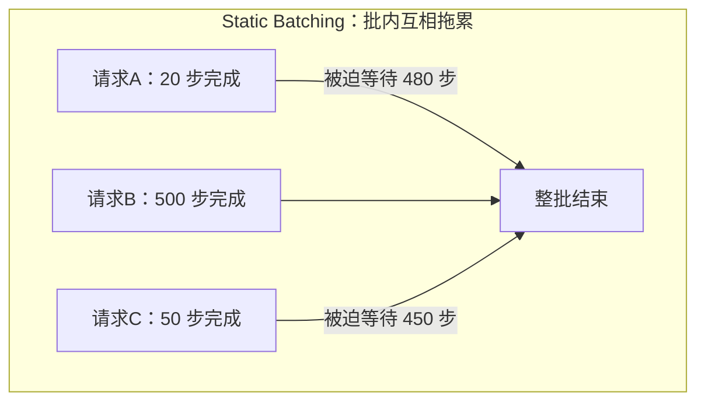
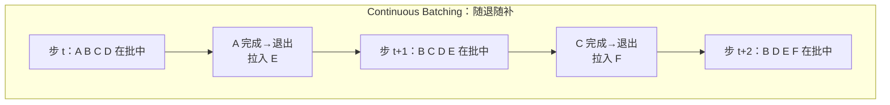

如果说 PagedAttention 解决的是"显存装得下多少请求"，那 Continuous Batching 解决的就是"装进来的请求能不能把 GPU 喂饱"。这是现代推理引擎吞吐飞跃的另一半功劳。这一节从传统批处理的致命短板讲起，说清 vLLM 为什么能把 GPU 利用率从约三成拉到八成以上——核心就一句话：**从"按批"调度改成"按迭代步"调度**。

<!-- more -->

## 📑 目录

- [1. 为什么要批处理](#1-为什么要批处理)
- [2. Static Batching 的致命短板](#2-static-batching-的致命短板)
- [3. Continuous Batching：迭代级调度](#3-continuous-batching迭代级调度)
- [4. 一次调度循环里发生了什么](#4-一次调度循环里发生了什么)
- [5. 与 PagedAttention 的协同](#5-与-pagedattention-的协同)
- [6. 调度中的关键权衡](#6-调度中的关键权衡)
- [总结](#-总结)
- [自我检验清单](#-自我检验清单)
- [参考资料](#-参考资料)

---

## 1. 为什么要批处理

先回到上一章的第一性原理：**Decode 阶段是 Memory Bound**，瓶颈在于把整个模型的权重从显存搬到计算单元。这里藏着一个巨大的机会——搬一次权重，本来只服务 1 个请求的 1 个 Token，太亏了；如果能让这一次搬运同时服务多个请求的 Token，算术强度就成倍上升，闲置的算力被利用起来。

这就是**批处理（Batching）**的价值：把多个请求的计算合并成一次大的矩阵运算，摊薄权重搬运的成本。

用类比来说，这就像通勤班车：为一个人发一趟车（搬一次权重只送一个 Token）油钱极不划算；坐满一车人再发（一个 Batch 服务多个请求），每个人分摊的成本骤降。批处理越大，单位 Token 的成本越低、系统吞吐越高。

📌 **关键点**：批处理提升的是**吞吐**，而且几乎不牺牲单请求延迟——因为瓶颈在搬权重，多算几个 Token 的计算量对 Memory Bound 的 Decode 来说近乎"免费"。问题只在于：**怎么组织这个 Batch？**

---

## 2. Static Batching 的致命短板

最朴素的做法叫 **Static Batching（静态批处理）**：攒够一批请求，一起送进模型，等这一批**全部生成完**，再开始下一批。

听起来合理，但它有一个致命短板——**请求的生成长度天差地别**。同一批里，请求 A 可能生成 20 个 Token 就结束了，请求 B 却要生成 500 个。在 Static Batching 下：

- 请求 A 在第 20 步就完事了，但它必须**待在批次里干等**，直到最慢的请求 B 跑完 500 步，整批才释放。
- A 早已完成的那 480 步里，它在 Batch 中占的那个"槽位"纯粹在空转——GPU 在为一个已经没有意义的位置做无用计算。

用类比来说：这就像拼车非要等所有乘客都到达各自终点后才让任何人下车。先到的乘客明明该下车了，却被锁在车上陪着绕路，座位白白占着，后面等车的人还上不来。

⚠️ **注意**：Static Batching 下，GPU 利用率经常只有 **30% 左右**——大量算力浪费在给已完成请求的空槽位做无效计算，同时新请求还必须等整批结束才能进来。请求长度差异越大，浪费越严重。

---

## 3. Continuous Batching：迭代级调度

Continuous Batching（连续批处理，也叫 In-flight Batching）的破局点是把调度的**粒度**从"一整批"细化到"一个迭代步（iteration）"。

🔑 **核心概念**：**Iteration-level Scheduling（迭代级调度）**——不再以"一批请求的完整生命周期"为调度单位，而是**每生成一步（一个 Token）就重新调度一次**。每一步结束后，引擎立刻检查：

- 哪些请求生成了 EOS 或达到长度上限？→ **立即移出批次，释放它的显存**，不必等别人。
- 显存和批次容量是否腾出了空间？→ **立即从等待队列拉新请求进来**，加入下一步计算。

于是批次的构成是**动态流动**的：请求随到随拼、完成即退，GPU 几乎每一步都在满负荷地为"当前真正还在生成"的请求干活，不再有空槽位空转。

回到拼车的类比：现在改成了**招手即停、到站就下**的公交——到站的乘客随时下车，空出的座位马上让站台上等着的人补上，车子始终坐得满满当当往前开。

📌 **关键点**：Continuous Batching 把 GPU 利用率从约 30% 拉到 **80% 以上**，吞吐随之大幅提升。它的收益来源有两块：一是**完成的请求立刻退出**，不再空转；二是**新请求立刻补位**，不必等整批结束，排队延迟也大幅下降。

---

## 4. 一次调度循环里发生了什么

把镜头拉近，看 vLLM 每一个 step 具体做了什么。可以理解为一个不停转的循环：

📥 **收新请求** → 🗂️ **调度** → ⚙️ **前向一步** → 📤 **处理产出** → 🔁 **回到开头**

1. **收新请求**：把新到达的请求放进 Waiting（等待）队列。
2. **调度决策**：调度器决定这一步谁上车。它要同时兼顾两拨请求——正在生成的 Running 队列请求（做 Decode），和等待队列里能塞进来的新请求（做 Prefill）。是否有空间，取决于显存里还有多少空闲 KV Block（这正是 PagedAttention 提供的信息）。
3. **前向计算一步**：对选中的这批请求跑一次模型前向，每个 Decode 请求产出 1 个新 Token，Prefill 请求产出首 Token。
4. **处理产出**：把新 Token 追加到各请求的 KV Cache；检查哪些请求触发了 EOS 或长度上限，将其标记完成、**释放其占用的 KV Block** 归还给空闲池。
5. **循环**：回到第 1 步。

💡 **提示**：当显存不够、Running 队列里请求太多时，调度器还会做**抢占（Preemption）**——把部分请求的 KV Cache 换出（Swap 到 CPU 内存）或直接丢弃后重算（Recompute），腾出显存保证其他请求推进。这部分调度细节我们放到第 3 章"vLLM 调度器源码导读"里深入。

---

## 5. 与 PagedAttention 的协同

Continuous Batching 和 PagedAttention 是一对**必须配合才能发挥威力**的搭档，理解这一点很关键：

- Continuous Batching 要做到"请求随退随补"，前提是**能随时、以细粒度分配和回收显存**。如果还是传统的连续大块分配，一个请求退出后留下的空隙未必能恰好塞下新请求，动态补位就无从谈起。
- PagedAttention 的**固定大小块 + 按需分配 + 即时回收**，恰好提供了这种细粒度的显存弹性：请求完成，它的块立刻回到空闲池；新请求进来，从空闲池按需取块。

| 技术 | 解决的问题 | 提供的能力 |
|---|---|---|
| PagedAttention | 显存碎片、利用率低 | 细粒度、可即时回收的显存分配 |
| Continuous Batching | GPU 空转、排队延迟 | 迭代级调度、动态批次构成 |

🔑 **核心概念**：**PagedAttention 管"显存怎么放"，Continuous Batching 管"请求怎么调度"，二者相乘才有 vLLM 的高吞吐。** 单有其一都不够——好比公交系统既要有灵活的座位管理，也要有招手即停的调度策略，缺一不可。

---

## 6. 调度中的关键权衡

Continuous Batching 虽好，但调度器面对的是一组相互冲突的目标，工程上要清楚这些权衡：

- **吞吐 vs 延迟**：一步里塞进的请求越多，系统吞吐越高，但每步的前向计算耗时也越长，单请求的 TPOT 会略微变差。批次大小需要在两者间取平衡。
- **Prefill vs Decode 的争抢**：新请求的 Prefill 是 Compute Bound 的重活，如果某一步塞进一个超长 Prompt 的 Prefill，会明显拖慢同批 Decode 请求的出字速度（TPOT 抖动）。这个问题正是下一节 **Chunked Prefill** 要解决的——把长 Prefill 切块，避免它一次性霸占整个 step。
- **公平性 vs 效率**：先来的请求是否优先？长请求会不会被短请求反复插队饿死？调度策略需要在整体效率和请求间公平之间做取舍。

⚠️ **注意**：Continuous Batching 让延迟指标变得**对负载敏感**。低负载时批次小、延迟低；高负载时批次变大、排队变长，P95/P99 尾延迟会明显上升。做容量规划时，一定要在**目标并发下**压测延迟，而不是看空载数据。

---

## 📝 总结

- 批处理的本质是**摊薄权重搬运成本**，把 Memory Bound 的 Decode 的算力利用起来，提升吞吐而几乎不增加延迟。
- **Static Batching** 的致命伤是"批内互相拖累"：短请求要陪最长的请求跑完，GPU 利用率常只有约 30%。
- **Continuous Batching** 把调度粒度细化到**迭代步**（Iteration-level Scheduling）：完成即退、随到随补，利用率提到 80%+。
- 它与 **PagedAttention** 深度协同：后者提供细粒度可回收的显存，前者才能实现动态批次构成。
- 调度存在**吞吐/延迟、Prefill/Decode 争抢、公平/效率**等权衡，其中 Prefill 干扰 Decode 的问题由 Chunked Prefill 进一步缓解。

## 🎯 自我检验清单

- 能从 Memory Bound 的角度解释批处理为什么能提升吞吐
- 能说清 Static Batching 中短请求被长请求拖累的具体机制
- 能解释 Iteration-level Scheduling 与批级调度的本质区别
- 能描述 vLLM 一次调度 step 中"退出完成请求、补入新请求"的流程
- 能说明为什么 Continuous Batching 必须依赖 PagedAttention 的细粒度显存管理
- 能分析批次大小对吞吐与 TPOT 的相反影响
- 能解释为什么长 Prompt 的 Prefill 会干扰同批 Decode，并知道该用什么技术缓解

## 📚 参考资料

- [vLLM 官方博客：Easy, Fast, and Cheap LLM Serving with PagedAttention](https://blog.vllm.ai/2023/06/20/vllm.html)
- [Orca: A Distributed Serving System for Transformer-Based Generative Models（迭代级调度提出者）](https://www.usenix.org/conference/osdi22/presentation/yu)
- [vLLM V1 Alpha Release（统一调度器设计）](https://blog.vllm.ai/2025/01/27/v1-alpha-release.html)
- [vLLM Documentation](https://docs.vllm.ai/en/latest/)
