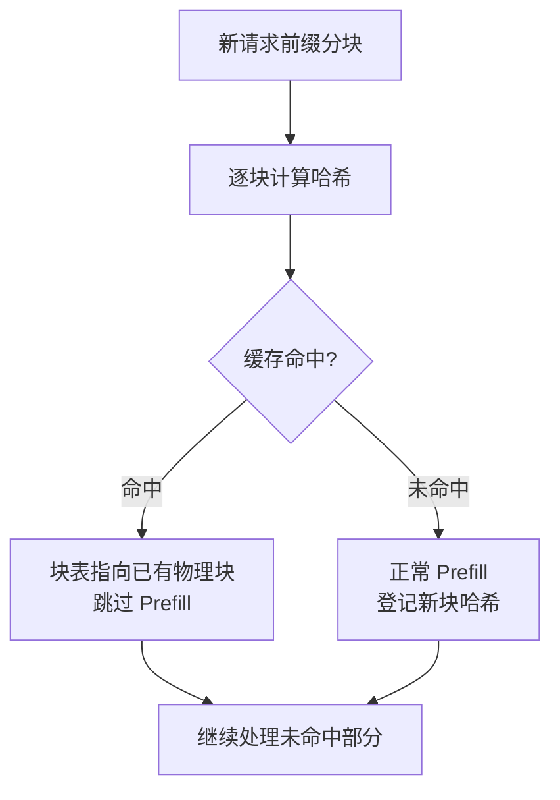

真实业务里，海量请求往往共享同一段开头——同一个几百 Token 的 System Prompt、同一份 Few-shot 示例、多轮对话里不断重复的历史。每来一个请求就把这段共享前缀重新 Prefill 一遍，是巨大的浪费。Prefix Cache 就是把这段共享前缀的 KV Cache 缓存下来、后续请求直接复用的技术。这一节讲清 vLLM 基于 Hash 的自动前缀缓存怎么工作，以及 SGLang 的 RadixAttention 在此之上的进阶思路。

<!-- more -->

## 📑 目录

- [1. 重复的前缀有多浪费](#1-重复的前缀有多浪费)
- [2. 复用的物理基础：块级 KV 共享](#2-复用的物理基础块级-kv-共享)
- [3. vLLM 的 Automatic Prefix Caching](#3-vllm-的-automatic-prefix-caching)
- [4. 缓存的淘汰：LRU 与引用计数](#4-缓存的淘汰lru-与引用计数)
- [5. SGLang 的 RadixAttention](#5-sglang-的-radixattention)
- [6. 适用场景与注意事项](#6-适用场景与注意事项)
- [总结](#-总结)
- [自我检验清单](#-自我检验清单)
- [参考资料](#-参考资料)

---

## 1. 重复的前缀有多浪费

先看几个再常见不过的场景：

- **共享 System Prompt**：一个客服机器人，每个请求前面都挂着 800 Token 的角色设定和规则说明，只有用户那句话不同。
- **Few-shot 提示**：分类任务里每个请求都带着相同的 10 个示例，几千 Token 的示例对所有请求都一样。
- **多轮对话**：第 5 轮对话的输入 = 前 4 轮的全部历史 + 新问题，前 4 轮的内容和第 4 轮请求高度重合。

这些场景的共同点是：**大量 Token 在不同请求间完全相同，且位置也相同（都在序列开头）**。而上一章讲过，Prefill 是 Compute Bound 的重活。把同一段 800 Token 的前缀对每个请求都重新 Prefill 一遍，等于反复做同样的昂贵计算。

📌 **关键点**：Attention 的因果性决定了——**一个 Token 的 Key/Value 只取决于它自己和它前面的 Token**。所以两个请求只要**前缀完全一致**，这段前缀每个 Token 算出来的 KV 就一模一样，完全可以只算一次、大家共用。

用类比来说：这就像一份标准合同，前面几页的通用条款对所有客户都一样，没必要给每个客户重新起草——存一份模板，签约时只补上后面的个性化条款即可。

---

## 2. 复用的物理基础：块级 KV 共享

前缀能复用的前提，是显存管理支持"多个请求指向同一份 KV"。这正是上一节 PagedAttention 打下的地基：

- KV Cache 以**固定大小的块**存储，请求通过块表间接引用物理块。
- 只要两个请求的某些前缀块内容相同，就让它们的块表**指向同一个物理块**，配合**引用计数**记录有几个请求在用。
- 一旦某请求在共享块之后要写入不同内容，Copy-on-Write 保证互不干扰。

所以 Prefix Cache 本质上是**把"共享前缀块"这件事从'同时并存的请求之间'扩展到'先后到达的请求之间'**：前一个请求算完的前缀块，先不急着扔，留在缓存里；后来的请求如果前缀匹配，直接复用这些块，跳过对应的 Prefill 计算。

🔑 **核心概念**：**Prefix Cache = 跨请求、跨时间地复用前缀 KV 块。** PagedAttention 的块共享是空间维度（并存请求共享），Prefix Cache 把它延伸到时间维度（先后请求复用）。

---

## 3. vLLM 的 Automatic Prefix Caching

vLLM 的方案叫 **Automatic Prefix Caching（APC，自动前缀缓存）**。"Automatic"是它的一大亮点——**你不需要手动声明哪段是共享前缀，引擎自动检测并复用**。它靠的是对 KV 块做哈希。

### 3.1 块哈希：如何判断"前缀相同"

关键问题是：怎么快速判断一个新请求的某个前缀块，和缓存里的某个块"内容相同"？vLLM 的做法是给每个**填满的块**算一个哈希值，这个哈希由三部分组成：

- **父块的哈希**（也就是它前面所有前缀块的哈希）
- **本块内 Token 的序列**
- **额外标识**（如 LoRA ID、多模态输入的哈希、cache salt 等）

$$
\text{block\_hash} = \text{Hash}(\text{parent\_hash},\ \text{block\_tokens},\ \text{extra})
$$

把"父块哈希"纳入计算是精髓所在：它保证了**只有从序列开头到当前块的整条前缀都完全一致，哈希才会相同**。这样就精确刻画了"前缀相同"这件事——第 3 个块的哈希相同，意味着前 3 个块的全部 Token 都相同。把块内 Token 也纳入哈希，则是为了降低哈希碰撞的概率。

💡 **提示**：vLLM 自 v0.11 起默认使用 `sha256` 作为哈希算法，也可通过 `--prefix-caching-hash-algo` 切换为 `sha256_cbor`（跨语言可复现）、`xxhash`、`xxhash_cbor` 等。非加密算法（如 xxhash）更快，但碰撞风险略高。

### 3.2 匹配与复用流程

新请求进来时，vLLM 逐块计算前缀哈希，拿去缓存表（hash → block ID 的映射）里查：

- **命中**：对应的物理块还在缓存里，直接把请求的块表指向它、增加引用计数，**跳过这部分 Prefill**。
- **未命中**：正常 Prefill 计算，算完后把新块的哈希登记进缓存，供后续请求复用。

📌 **关键点**：命中前缀缓存能**直接砍掉那部分 Prefill 的计算**，最直接的收益是**大幅降低 TTFT**（首 Token 更快出来），同时省下的算力还能服务更多请求。共享前缀越长、命中率越高，收益越大。

### 3.3 V1 的"零开销"设计

早期版本（V0）里，前缀缓存因为命中率低时 CPU 记账开销不划算，默认是关闭的。vLLM **V1 引擎**对此做了重写：所有块在初始化时预分配成一个块池，用嵌入块内的双向链表指针做 O(1) 的移动与淘汰，把记账开销压到极低——官方称之为"几乎免费的午餐"，即使命中率为 0% 性能也几乎不退化。因此 **V1 中前缀缓存默认开启**。

---

## 4. 缓存的淘汰：LRU 与引用计数

缓存空间有限，物理块用完了就得淘汰旧的。vLLM 的策略结合了**引用计数**和 **LRU（最近最少使用）**：

- **正在被使用的块不能淘汰**：引用计数 > 0 的块（还有请求在用）受保护。
- **空闲块按 LRU 淘汰**：请求结束后，它的块引用计数归零、进入空闲队列，但**内容和哈希先保留着**——万一马上有匹配的新请求来，还能命中复用。当显存吃紧需要腾地方时，才真正回收最久没被用到的空闲块。

一个有意思的细节：vLLM 释放块时，是把请求的块**按逆序**放进空闲队列尾部。因为一个请求的**最后一个块**哈希了最多的 Token（前缀最长），最不容易被别的请求命中复用，所以让它**优先被淘汰**；而靠前的块（短前缀，如共享 System Prompt 的开头）更可能被复用，就让它们更晚淘汰。

💡 **提示**：这个"逆序入队"的小设计体现了一个朴素直觉——**越靠近序列开头的前缀，越通用、越值得留**；越靠后的前缀越个性化，留着也难命中。

---

## 5. SGLang 的 RadixAttention

vLLM 的 Hash 方案高效，但它有个隐含限制：**匹配是"块对齐"且"线性前缀"的**——按块边界比对一条从头开始的前缀。而多轮对话、树状采样等场景里，请求的共享关系是**树状**的：一个共同前缀分叉出多个不同的后续。

SGLang 提出的 **RadixAttention** 用一棵 **Radix Tree（基数树/压缩前缀树）** 来管理 KV Cache 的复用：

- 树的每条边代表一段 Token 序列，从根到某节点的路径就是一段前缀，对应缓存的 KV。
- 新请求到来时，沿树做**最长前缀匹配**，匹配到的路径部分直接复用 KV，只对分叉之后的新内容做计算。
- 分叉天然对应"共同前缀 + 不同后续"，非常契合多轮对话（同一段历史派生多轮）和并行采样（同一 Prompt 采样多个回答）。

| 📊 维度 | vLLM Automatic Prefix Caching | SGLang RadixAttention |
|---|---|---|
| 数据结构 | Hash 表（块哈希 → 块 ID） | Radix Tree（压缩前缀树） |
| 匹配方式 | 块对齐的前缀哈希匹配 | 树上最长前缀匹配 |
| 擅长场景 | 通用共享前缀（System Prompt、Few-shot） | 树状共享（多轮对话、树采样） |
| 淘汰策略 | LRU + 引用计数 | 基于树的 LRU |

🔑 **核心概念**：两者目标一致——**复用共享前缀的 KV、跳过重复 Prefill**；区别在数据结构。Hash 表简单高效、适合线性前缀；Radix Tree 更擅长表达和利用树状的前缀共享关系。

⚠️ **注意**：不要把它们对立起来看。vLLM 的方案在绝大多数场景已经很够用，且随 V1 做到了近乎零开销；RadixAttention 是在**高度树状复用**的负载下（如复杂 Agent、大量并行采样）展现出额外优势。选型时看你的负载形态，而非简单认为"树一定比哈希好"。

---

## 6. 适用场景与注意事项

✅ **前缀缓存收益大的场景**：

- 长 System Prompt / 长 Few-shot 且被大量请求共享
- 多轮对话（历史不断累积复用）
- 同一 Prompt 并行采样多个输出（`n > 1`）
- RAG 中固定的指令模板 + 变化的检索内容（固定部分放前面才能命中）

❌ **收益有限甚至无收益的场景**：

- 每个请求前缀都不同（如无模板的自由问答）
- 共享部分放在了 Prompt**中间或末尾**——前缀缓存只能复用**从头开始连续相同**的部分，共享内容一旦不在开头就无法命中

📌 **关键点**：想吃到前缀缓存的红利，**Prompt 工程上要有意识地"把公共内容前置"**——固定不变的指令、示例、上下文放最前面，变化的用户输入放最后。这是一条几乎零成本却常被忽视的优化。

⚠️ **注意**：前缀缓存**不改变模型输出**（复用的是数学上完全等价的 KV），可以放心开启。但要留意多租户环境下的隔离——vLLM 提供 `cache_salt` 等机制，避免不同租户/权限的请求意外命中彼此的缓存造成信息泄露。

---

## 📝 总结

- Prefix Cache 复用**共享前缀的 KV**，跳过重复 Prefill，核心收益是**降低 TTFT + 提升吞吐**。
- 它的物理基础是 PagedAttention 的**块级共享 + 引用计数 + CoW**，把块共享从"并存请求"延伸到"先后请求"。
- vLLM 的 **Automatic Prefix Caching** 用**含父块哈希的块哈希**自动检测相同前缀；V1 做到近乎零开销、默认开启；用 **LRU + 引用计数**淘汰，并按逆序入队优先淘汰个性化的尾块。
- SGLang 的 **RadixAttention** 用 **Radix Tree** 做最长前缀匹配，更擅长多轮对话、树状采样等树状复用场景。
- 实践中要**把公共内容前置**才能命中，并注意多租户下的缓存隔离。

## 🎯 自我检验清单

- 能解释为什么"前缀相同"的请求可以复用同一份 KV（Attention 因果性）
- 能说清 Prefix Cache 与 PagedAttention 块共享在时间维度上的联系
- 能描述 vLLM 块哈希为什么要包含"父块哈希"，以及它如何刻画"前缀相同"
- 能说明前缀缓存命中主要优化的是哪个指标（TTFT）及原因
- 能解释 vLLM 释放块时"逆序入队"背后的直觉
- 能对比 Hash 方案与 RadixAttention 的数据结构与擅长场景
- 能指出哪些 Prompt 组织方式能/不能命中前缀缓存

## 📚 参考资料

- [vLLM Design — Automatic Prefix Caching](https://docs.vllm.ai/en/latest/design/prefix_caching.html)
- [vLLM V1 Alpha Release（零开销前缀缓存）](https://blog.vllm.ai/2025/01/27/v1-alpha-release.html)
- [SGLang: Efficient Execution of Structured Language Model Programs（RadixAttention）](https://arxiv.org/abs/2312.07104)
- [vLLM Documentation](https://docs.vllm.ai/en/latest/)
