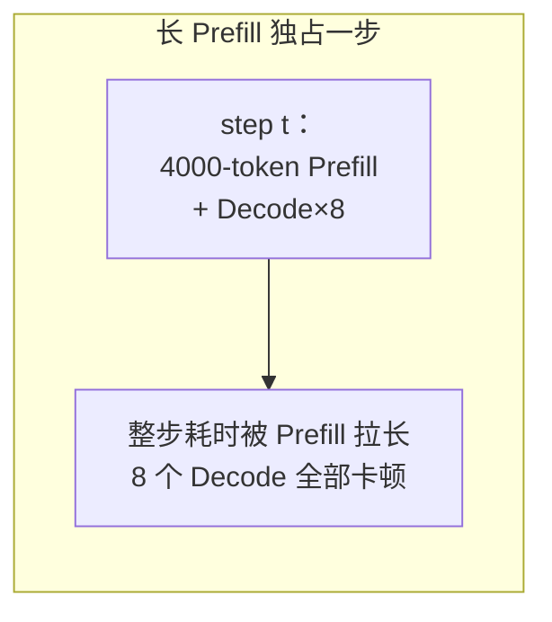
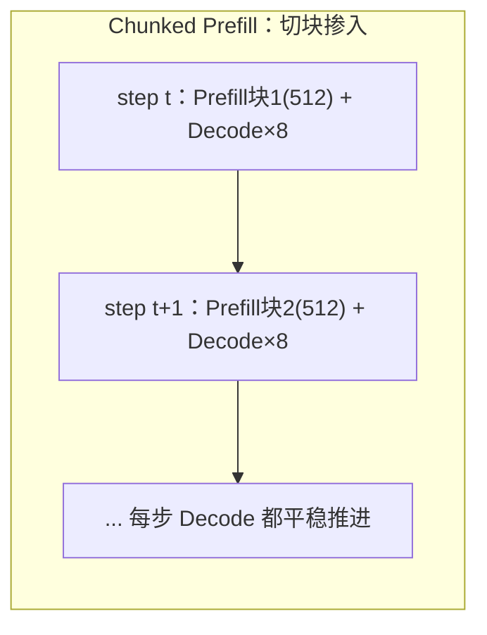

Continuous Batching 那一节留了个尾巴：当一个超长 Prompt 的 Prefill 挤进某一步计算时，会把同批正在生成的 Decode 请求全部拖慢，用户能明显感到"卡了一下"。Chunked Prefill 就是来收拾这个尾巴的——把长 Prefill 切成小块，掺进 Decode 的间隙里做，谁也不耽误谁。而 vLLM V1 更进一步，用一个统一的 Token 预算调度器，把 Prefill 和 Decode 的界限彻底抹平。这一节讲透这两件事。

<!-- more -->

## 📑 目录

- [1. Prefill 是怎么拖慢 Decode 的](#1-prefill-是怎么拖慢-decode-的)
- [2. Chunked Prefill：把长 Prefill 切块](#2-chunked-prefill把长-prefill-切块)
- [3. Token Budget：调度的统一货币](#3-token-budget调度的统一货币)
- [4. vLLM V1 的统一调度器](#4-vllm-v1-的统一调度器)
- [5. 关键参数与调优](#5-关键参数与调优)
- [6. 权衡与适用场景](#6-权衡与适用场景)
- [总结](#-总结)
- [自我检验清单](#-自我检验清单)
- [参考资料](#-参考资料)

---

## 1. Prefill 是怎么拖慢 Decode 的

先把干扰的机制讲清楚。回顾上一章的两条结论：

- **Prefill 是 Compute Bound**：一次要并行处理整段 Prompt 的所有 Token，Prompt 越长，这一步的矩阵运算量越大、耗时越久。
- **Decode 是 Memory Bound**：每步只处理 1 个 Token，本身很快，用户感受到的出字速度（TPOT）就靠它一步一步稳定推进。

问题出在：Continuous Batching 是**每一步重新组批**的。如果某一步里，调度器把一个 4000 Token 的长 Prompt 的 Prefill 和一批 Decode 请求塞进了同一个 step，那么这一步的耗时会被那个庞大的 Prefill 计算**整体拉长**——同批所有 Decode 请求的这个 Token 都得等 Prefill 算完才能一起出来。

用类比来说：Decode 请求像流水线上匀速前进的小件包裹，本来每几秒过一个；突然来了一个巨大的集装箱（长 Prefill）也要挤上同一条流水线过检，整条线被它堵住，后面的小包裹全部被迫等待。用户端的表现就是：**出字很流畅，然后突然卡顿一下，再恢复流畅**——TPOT 出现尖刺（P99 抖动）。



📌 **关键点**：这不是"要不要批处理"的问题，而是"**一步里塞了太多 Compute Bound 的活**"。既然长 Prefill 是罪魁，那把它拆小、分几步做，不就不会一次性堵死流水线了吗？

---

## 2. Chunked Prefill：把长 Prefill 切块

**Chunked Prefill（分块预填充）** 的思路非常直接：**不要求一个长 Prompt 在一步里 Prefill 完，而是把它切成若干个固定大小的 Chunk（块），分散到多个 step 里逐块处理。**

比如一个 4000 Token 的 Prompt，切成每块 512 Token，就分成 8 个 Chunk。每一步只处理其中一块，剩下的算力**留给同批的 Decode 请求正常出字**。这样：

- 每一步的计算量被控制在一个可预期的范围内，不会被超长 Prefill 突然撑爆。
- Decode 请求得以在长 Prefill 进行的同时**持续、平稳地推进**，TPOT 尖刺被抹平。



用回流水线的类比：现在把那个大集装箱**拆成一箱箱标准货物**，每次过检只放一箱进流水线，中间穿插着让小包裹继续通过。集装箱是慢慢过完了，但整条线始终匀速运转，没有谁被彻底堵死。

🔑 **核心概念**：**Chunked Prefill 用"把大块 Prefill 摊到多步"换来"Decode 的平稳"**，本质是把一次性的计算尖峰削平成多个可控的小峰，从而稳住 TPOT 尾延迟。

⚠️ **注意**：切块会让这个长 Prompt 的 **TTFT 略微变大**（它要跨多步才 Prefill 完，首 Token 出得稍晚）。这是一个刻意的权衡——**牺牲少量单请求 TTFT，换取整批 Decode 的 TPOT 稳定**。在追求平稳出字体验的服务里，这笔交易通常很划算。

---

## 3. Token Budget：调度的统一货币

Chunked Prefill 要落地，调度器需要一个统一的"度量衡"来决定每一步塞多少活。这个度量衡就是 **Token Budget（Token 预算）**。

核心洞察是：**无论 Prefill 还是 Decode，对 GPU 来说本质都是"处理若干个 Token 的前向计算"**。

- 一个做 Decode 的请求，这一步贡献 **1 个 Token**（生成下一个）。
- 一个做 Prefill 的请求（或它的一个 Chunk），这一步贡献 **N 个 Token**（这一块的长度）。

于是调度器给每一步设定一个总的 Token 预算上限（比如"这一步最多处理 2048 个 Token"），然后往里面装请求：先保证正在生成的 Decode 请求（每个占 1 个 Token 额度），剩下的预算再分给 Prefill 的 Chunk。预算用完，这一步就发车。

$$
\underbrace{\sum \text{Decode 请求}}_{\text{每个 1 token}} + \underbrace{\sum \text{Prefill Chunk}}_{\text{每个 chunk\_size token}} \leq \text{token\_budget}
$$

💡 **提示**：用 Token 预算这把统一的尺子，"Chunk 该切多大""一步能塞几个 Decode""长 Prefill 和 Decode 怎么共处一步"这些问题就都归结成了同一个装箱问题——**在预算内尽量把 GPU 装满，同时优先保证 Decode 不断流**。

---

## 4. vLLM V1 的统一调度器

早期的 vLLM（V0）调度器里，Prefill 和 Decode 是**两类被区别对待**的阶段，调度逻辑要分别处理，代码复杂且容易在两者切换时产生空隙。

vLLM **V1 引擎**做了一个漂亮的简化：**彻底取消 Prefill 和 Decode 的二分**。在 V1 的调度器眼里，没有"Prefill 请求"和"Decode 请求"之分，只有"这一步每个请求要处理多少个 Token"。调度决策被表达成一个简洁的字典：

```python
# V1 调度器每一步的决策，本质是这样一个映射
{
    "req_A": 1,      # 正在 Decode，处理 1 个新 token
    "req_B": 1,      # 正在 Decode，处理 1 个新 token
    "req_C": 512,    # 长 Prompt 的一个 Prefill chunk
    "req_D": 128,    # 短 Prompt，一步就能 Prefill 完
}
# 约束：所有 value 之和 ≤ token_budget
```

🔑 **核心概念**：**V1 用 `{request_id: num_tokens}` 这一个统一表示，同时涵盖了 Chunked Prefill、Prefix Cache 和 Speculative Decoding。** 因为它们本质都是"某个请求这一步要处理多少 Token"的不同取值——Prefill chunk 是一个较大的值，Decode 是 1，投机解码验证是若干个候选 Token。一套调度框架，优雅地统一了所有情况。

这也是为什么 V1 能把 Chunked Prefill 做成**默认行为**：既然调度天然以 Token 为单位、不区分阶段，长 Prompt 自然就被预算约束切成了 Chunk，无需额外的特殊逻辑。

---

## 5. 关键参数与调优

在 vLLM 中，与本节相关的核心参数主要是两个：

| ⚙️ 参数 | 含义 | 调优方向 |
|---|---|---|
| `max_num_batched_tokens` | 一步能处理的最大 Token 数（即 Token Budget） | 调大 → 吞吐↑、单步耗时↑（TPOT 可能↑）；调小 → TPOT 更稳、吞吐可能↓ |
| `max_num_seqs` | 一步最多容纳的请求数（批次上限） | 受显存/KV Block 约束，与上者共同决定实际批大小 |

调优的核心是围绕 `max_num_batched_tokens` 做取舍：

- **偏吞吐**：把预算调大，一步塞更多 Token，GPU 装得更满，系统吞吐更高，但长 Prefill 占的比重上升，Decode 的 TPOT 稳定性会下降。
- **偏延迟稳定**：把预算调小，每步计算量更可控，Decode 出字更平稳、TPOT 尾延迟更低，但单步能干的活变少，峰值吞吐可能受限。

💡 **提示**：没有放之四海皆准的最优值。正确做法是**在你的目标负载（真实的 Prompt 长度分布、并发量）下压测**，观察 TTFT、TPOT P95/P99 和吞吐三条曲线，找到满足 SLO 的最大吞吐点。具体调参会在第 3 章"vLLM 关键配置调优"里结合实例展开。

---

## 6. 权衡与适用场景

✅ **Chunked Prefill 收益明显的场景**：

- Prompt 长度差异大、且有超长 Prompt 混入（长文档问答、长上下文 RAG）
- 对出字流畅度敏感、要压 TPOT 尾延迟的在线服务（如实时对话）
- Prefill 和 Decode 请求混合的高并发在线负载

❌ **收益有限的场景**：

- 纯离线批量推理、只追求总吞吐而不在乎单请求延迟抖动——此时切块带来的调度开销未必划算
- Prompt 都很短、本来就不会有长 Prefill 独占一步的情况

📌 **关键点**：Chunked Prefill 优化的是 **Prefill 与 Decode 混跑时的相互干扰**，它是"平稳性"优化而非"峰值吞吐"优化。判断要不要用、怎么调，关键看你的服务**是否在乎 TPOT 的稳定性**，以及负载里**有没有长 Prompt**。

⚠️ **注意**：Chunked Prefill 与 Prefix Cache 是天然搭档——前缀命中先砍掉一部分 Prefill 计算，剩下未命中的部分再切块掺入 Decode。二者叠加，长 Prompt 场景下的 TTFT 和 TPOT 能同时得到照顾。

---

## 📝 总结

- 长 Prompt 的 Prefill 挤进一步会**整体拉长该步耗时**，导致同批 Decode 请求 TPOT 出现尖刺。
- **Chunked Prefill** 把长 Prefill 切成固定大小 Chunk 分散到多步，用少量 TTFT 增加换来 Decode 的**平稳出字**。
- **Token Budget** 是统一的调度货币：Decode 每请求占 1 个 Token 额度，Prefill Chunk 占 chunk 长度，一步在预算内装箱。
- vLLM **V1 统一调度器**用 `{request_id: num_tokens}` 抹平 Prefill/Decode 边界，一套框架涵盖 Chunked Prefill、Prefix Cache、投机解码。
- 核心调参是 `max_num_batched_tokens`（吞吐↔TPOT 稳定性的权衡），需在目标负载下压测确定。

## 🎯 自我检验清单

- 能解释长 Prefill 为什么会拖慢同批 Decode 请求的 TPOT
- 能描述 Chunked Prefill 如何把计算尖峰削平成多个小峰
- 能说清 Chunked Prefill 用什么代价（TTFT）换来什么收益（TPOT 稳定）
- 能解释 Token Budget 为什么能统一度量 Prefill 和 Decode
- 能说明 vLLM V1 用 `{request_id: num_tokens}` 统一表示带来的好处
- 能描述 `max_num_batched_tokens` 调大/调小分别如何影响吞吐与 TPOT
- 能判断自己的负载是否适合开启 Chunked Prefill

## 📚 参考资料

- [SARATHI: Efficient LLM Inference by Piggybacking Decodes with Chunked Prefills](https://arxiv.org/abs/2308.16369)
- [vLLM V1 Alpha Release（统一 Token 预算调度器）](https://blog.vllm.ai/2025/01/27/v1-alpha-release.html)
- [vLLM Documentation — Optimization and Tuning](https://docs.vllm.ai/en/latest/)
