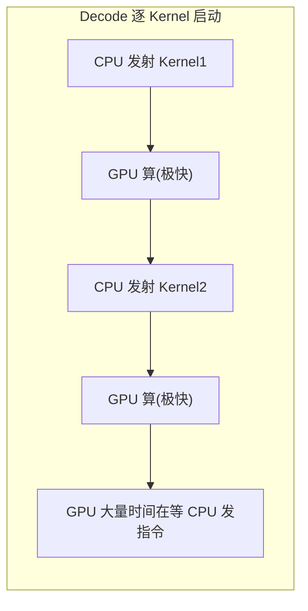
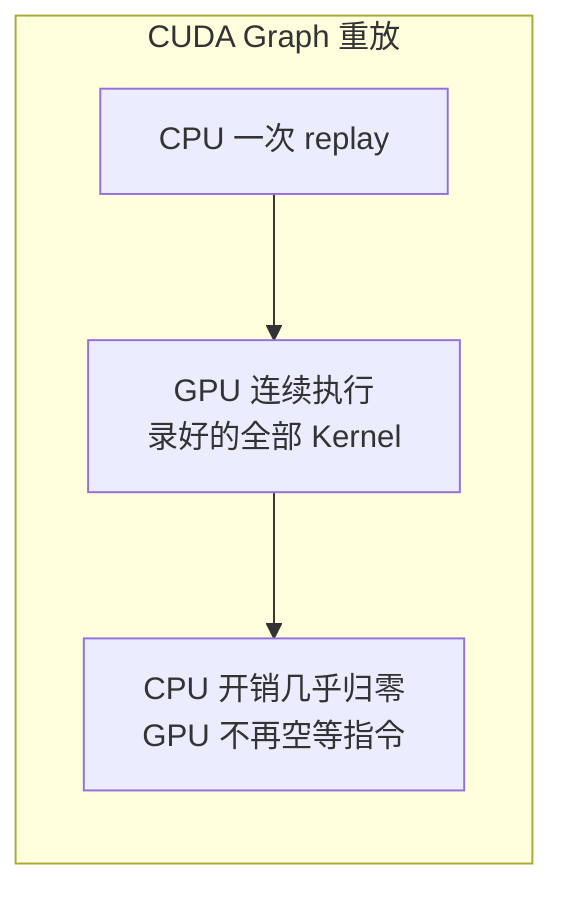
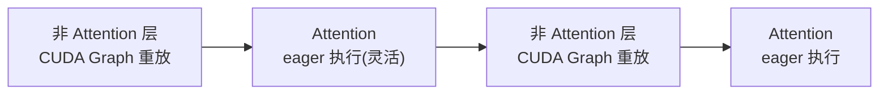

前四节讲的都是"宏观"的技术——怎么管显存、怎么组批、怎么复用前缀、怎么切块。这一节把镜头拉到"微观"：**同样一批请求的一次前向计算，怎么让它跑得更快？** 答案落在两件事上：一是选对高效的 **Attention 后端 Kernel**，二是用 **CUDA Graph + torch.compile** 消除 Decode 阶段那些看不见却致命的 CPU 开销。这也是 vLLM V1 相比 V0 提速的重要来源之一。

<!-- more -->

## 📑 目录

- [1. 一个反直觉的瓶颈：CPU 拖了 GPU 的后腿](#1-一个反直觉的瓶颈cpu-拖了-gpu-的后腿)
- [2. 可插拔的 Attention 后端](#2-可插拔的-attention-后端)
- [3. 后端如何处理 Prefill/Decode 混合批次](#3-后端如何处理-prefilldecode-混合批次)
- [4. CUDA Graph：把一串 Kernel 启动打包成一次](#4-cuda-graph把一串-kernel-启动打包成一次)
- [5. torch.compile 与 Piecewise CUDA Graph](#5-torchcompile-与-piecewise-cuda-graph)
- [6. 实践中的开关与权衡](#6-实践中的开关与权衡)
- [总结](#-总结)
- [自我检验清单](#-自我检验清单)
- [参考资料](#-参考资料)

---

## 1. 一个反直觉的瓶颈：CPU 拖了 GPU 的后腿

先抛一个反直觉的现象。上一章我们论证了 Decode 是 Memory Bound——瓶颈在从显存搬权重。但当模型不大、Batch 也不大时，还有一个更隐蔽的瓶颈会冒出来：**CPU 发射 Kernel 的开销**。

GPU 自己不会主动干活，它每做一个操作（一次矩阵乘、一次 LayerNorm、一次激活……），都要由 CPU 通过一次"启动（launch）"命令告诉它。跑一遍 Transformer，有成百上千个这样的小操作，就对应成百上千次 CPU→GPU 的启动调用。每次启动本身有固定的 CPU 开销（构造参数、驱动调度、提交队列），量级在微秒级。

平时这点开销不算什么——因为 Prefill 一步要处理成千 Token，每个 GPU Kernel 一跑就是几百微秒甚至毫秒，CPU 那点启动开销被淹没了。但 **Decode 每步只处理 1 个（或很少几个）Token**，每个 Kernel 的实际计算可能就几微秒，结果**CPU 发射这个 Kernel 的时间比 GPU 执行它的时间还长**。于是 GPU 干几微秒就停下来，眼巴巴等 CPU 发下一条命令——算力再次闲置，只不过这次不是等数据，是**等指令**。

📌 **关键点**：Decode 阶段有两重"等待"——**等数据**（Memory Bound，靠 Batching/量化缓解）和**等指令**（CPU launch 开销，靠本节的图优化缓解）。小模型、小 Batch 时，后者尤其突出。这就是为什么图优化对 Decode 加速格外有效。

---

## 2. 可插拔的 Attention 后端

Attention 是 Transformer 里最重、最讲究的算子，它的 Kernel 实现直接决定推理速度。vLLM 的设计哲学是**不绑死一种实现，而是提供可插拔的 Attention 后端**，根据硬件、模型结构和场景自动或手动选择最优的那一个。

常见的后端包括：

| 🏷️ 后端 | 特点 | 典型适用 |
|---|---|---|
| **FlashAttention** | IO 感知的经典高性能实现，支持到 FlashAttention 3 | 主流 NVIDIA GPU 的通用首选 |
| **FlashInfer** | 面向推理优化，KV Cache 处理灵活，支持多种数据类型 | 高吞吐服务、需要灵活 KV 布局 |
| **FlashMLA** | 针对 MLA（Multi-head Latent Attention）优化 | DeepSeek 等采用 MLA 结构的模型 |
| **Triton** | 用 Triton 语言实现，可移植性好 | 非 NVIDIA 硬件或需自定义时的兜底 |

🔑 **核心概念**：Attention 后端是**同一个数学操作的不同工程实现**。它们算出的结果在数学上等价，区别在于**访存模式、并行策略、对特定硬件指令和模型结构的适配程度**。选对后端，同样的卡能跑出明显不同的吞吐。

💡 **提示**：多数情况下不用手动指定，vLLM 会根据 GPU 架构、模型类型和数据精度**自动挑选**合适的后端。只有在做深度性能调优、或跑特殊模型结构（如 MLA）时，才需要显式干预。由于后端支持矩阵随版本演进较快，具体某张卡/某个模型用哪个后端，以你所用 vLLM 版本的官方文档为准。

---

## 3. 后端如何处理 Prefill/Decode 混合批次

这里有个上一节埋下的关键联系。vLLM V1 的统一调度器会把 **Prefill 的 Chunk 和 Decode 请求塞进同一步**——那么这一步的 Attention 该怎么算？毕竟 Prefill 部分要算"一整段新 Token 之间 + 对历史的注意力"，Decode 部分只算"1 个新 Token 对全部历史的注意力"，两者的计算形态不一样。

这就要求 Attention 后端**原生支持混合批次（mixed prefill/decode batch）**：在一次 Kernel 调用里，同时正确处理批中既有 Prefill 又有 Decode 的请求。FlashAttention 3 等现代后端正是为此设计的——它能接受变长的、混合阶段的输入，用统一的 Kernel 高效算完，而不需要把 Prefill 和 Decode 拆成两次 Kernel 调用。

📌 **关键点**：**"统一调度器"（软件层抹平 Prefill/Decode）和"支持混合批次的 Attention 后端"（Kernel 层抹平 Prefill/Decode）是配套的。** 没有后者，V1 那套优雅的 Token 预算调度就落不了地。这也是为什么 V1 对 Attention 后端的能力有要求，早期不是所有后端都能支持。

---

## 4. CUDA Graph：把一串 Kernel 启动打包成一次

回到第 1 节的 CPU launch 开销。**CUDA Graph** 是 NVIDIA 提供的解药：把一连串固定的 GPU 操作**录制（capture）**成一张"图"，之后只需一条命令**重放（replay）**整张图，GPU 就会依次执行录好的所有 Kernel——**成百上千次 CPU 启动被压缩成一次**。

用类比来说：没有 CUDA Graph，就像老师每讲一句话都要等秘书传一次话（每个 Kernel 都要 CPU 单独发射）；有了 CUDA Graph，相当于老师提前把整段讲稿录好，上课时按一下播放键，一气呵成放完，中间不用秘书再一句句传。

但 CUDA Graph 有个硬性前提：**录制的操作序列和张量形状必须固定**。这对 Decode 是天作之合——每步都是"处理固定 Batch 个 Token"，形状稳定，可以针对不同的 Batch Size 分别录制好图，运行时按当前 Batch Size 选对应的图重放。

⚠️ **注意**：正因为要求形状固定，vLLM 只为**一组预设的 Batch Size** 捕获 CUDA Graph（可通过 `cudagraph_capture_sizes` 调整）。当实际 Batch Size 命中某个已捕获的尺寸时才走重放，否则回退到逐 Kernel 启动。这也意味着 CUDA Graph 的收益主要体现在 Decode（形状规整），而多变的 Prefill 较难直接套用。

---

## 5. torch.compile 与 Piecewise CUDA Graph

CUDA Graph 解决了"启动开销"，但还有一层优化空间：**能不能把很多小 Kernel 本身合并成更少、更大的 Kernel？** 这就是 `torch.compile` 干的事——它把模型的前向计算**编译**成优化后的图，通过算子融合（fusion）等手段减少 Kernel 数量。在 vLLM V1 中，`torch.compile` 默认开启，且**所有编译在开始服务前完成**，避免请求过程中触发编译导致延迟尖刺。

但这里有个矛盾：CUDA Graph 要求整段操作形状固定，而 **Attention 恰恰是最难被 CUDA Graph 兼容的部分**——它涉及变长的 KV、复杂的 Mask，形状不那么规整。如果因为 Attention 不好处理就放弃整张图的 CUDA Graph，就太可惜了。

vLLM V1 的巧解是 **Piecewise CUDA Graph（分段 CUDA Graph）**：

- 把整个前向图**在 Attention 算子处切开**（Attention 被包装成一个"不透明"的自定义算子，编译器不去动它）。
- **Attention 之外的部分**（LayerNorm、各种 GEMM、激活、残差……这些都是规整的 token-wise 操作）用 CUDA Graph 捕获、重放。
- **Attention 本身保持 eager（即时）执行**，保留它处理变长 KV 的灵活性。

🔑 **核心概念**：**Piecewise CUDA Graph = 对规整的部分用图优化榨干 CPU 开销，对灵活的 Attention 网开一面保留 eager。** 二者各取所长：CPU launch 开销大头（那成百上千个小算子）被 CUDA Graph 消灭，而 Attention 的灵活性（支持混合批次、变长 KV）不受损。这正是 V1 相比 V0 在 Decode 上提速的关键工程之一。

💡 **提示**：vLLM 也支持在兼容后端下做 **Full CUDA Graph**（把 Attention 也纳入捕获），文档指出这在"小模型或 MoE 的 Decode"等场景能进一步提速。Piecewise 是通用的默认，Full 是特定场景的进阶选项。

---

## 6. 实践中的开关与权衡

对使用者来说，这些优化大多是**默认开启、自动生效**的，日常无需操心。但了解它们的权衡有助于排查问题和调优：

- ✅ **收益**：Decode 阶段 CPU 开销大幅下降，小模型/小 Batch 下的吞吐和延迟明显改善；`torch.compile` 的算子融合进一步减少 Kernel 数量。
- ❌ **代价**：
  - **启动变慢**：服务启动时要做编译和 CUDA Graph 捕获，首次拉起耗时增加（vLLM 用编译缓存缓解，缓存目录可复制以加速后续启动）。
  - **显存占用**：捕获多个 Batch Size 的 CUDA Graph 需要额外显存。
  - **调试复杂度**：编译后的图不如 eager 模式好调试，排查数值问题时可能需要临时关掉。

⚠️ **注意**：遇到疑难的数值异常或想确认某个 Kernel 行为时，可以临时用 eager 模式（关闭 `torch.compile`/CUDA Graph）对比。定位完再打开——生产环境务必保持开启，否则会白白损失 Decode 性能。具体的开关参数与优化级别以对应 vLLM 版本的官方文档为准。

---

## 📝 总结

- Decode 阶段除了"等数据"（Memory Bound），还有"等指令"——**CPU 逐 Kernel 启动的开销**，小模型/小 Batch 下尤为突出。
- vLLM 提供**可插拔 Attention 后端**（FlashAttention/FlashInfer/FlashMLA/Triton），数学等价而工程各异，通常自动选择。
- 现代后端需**原生支持 Prefill/Decode 混合批次**，与 V1 的统一调度器配套。
- **CUDA Graph** 把成百上千次 Kernel 启动压成一次重放，消除 CPU 开销，但要求形状固定（契合 Decode）。
- **Piecewise CUDA Graph** 在 Attention 处切图：规整部分走 CUDA Graph，Attention 保持 eager，兼得性能与灵活性，是 V1 提速的关键工程。
- 这些优化默认开启，代价是启动变慢、额外显存和调试复杂度，生产环境应保持开启。

## 🎯 自我检验清单

- 能解释为什么 Decode 阶段 CPU 的 Kernel 启动开销会成为瓶颈
- 能说出至少三种 vLLM Attention 后端及各自的适用场景
- 能解释"数学等价、工程不同"的 Attention 后端意味着什么
- 能说明为什么统一调度器需要后端支持 Prefill/Decode 混合批次
- 能描述 CUDA Graph 通过"录制—重放"消除 CPU 开销的原理及其形状固定的前提
- 能解释 Piecewise CUDA Graph 为什么在 Attention 处切图，以及这样做的好处
- 能说清这些图优化的代价（启动、显存、调试）与生产环境的取舍

## 📚 参考资料

- [FlashAttention: Fast and Memory-Efficient Exact Attention with IO-Awareness](https://arxiv.org/abs/2205.14135)
- [vLLM Design — torch.compile Integration](https://docs.vllm.ai/en/latest/design/torch_compile.html)
- [vLLM V1 Alpha Release（Piecewise CUDA Graph、FlashAttention 3）](https://blog.vllm.ai/2025/01/27/v1-alpha-release.html)
- [NVIDIA Developer Blog — Getting Started with CUDA Graphs](https://developer.nvidia.com/blog/cuda-graphs/)
- [vLLM Documentation](https://docs.vllm.ai/en/latest/)
